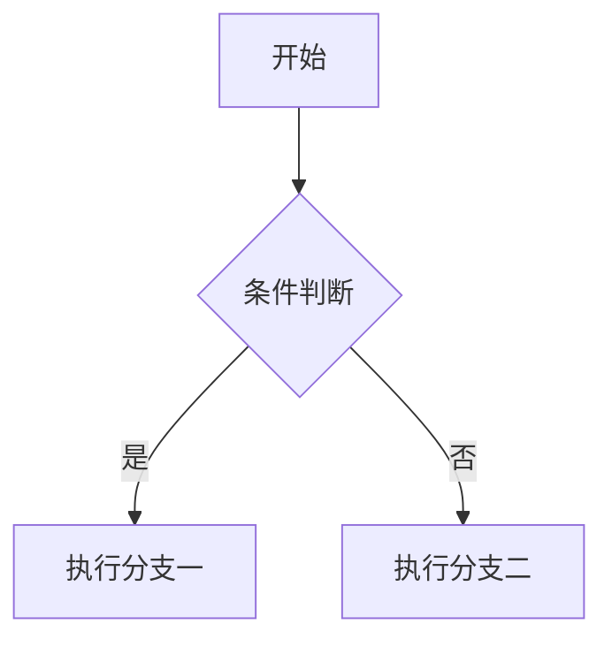

# 花生苗 Markdown 编辑器 · 用户手册

| 项目 | 内容 |
| --- | --- |
| 软件名称 | 花生苗 Markdown 编辑器 |
| 英文标识 | `huashengmiao-markdown` |
| 当前版本 | 1.0.0 |
| 作者 | 何飞 |
| 联系方式 | 微信 6731663 |
| 开源协议 | MIT License，Copyright (c) 2025 何飞 (He Fei) |
| 产品定位 | 开源免费、所见即所得（Typora 类）、跨平台、轻量高性能的 Markdown 编辑器 |
| 适用平台 | Windows 10/11、主流 Linux 发行版；macOS 说明见第 1 章 |
| 手册语言 | 简体中文 |

> 🌱 **一句话认识它**：下载安装包、双击即用，不需要配置任何开发环境；光标所在行写 Markdown 源码，其余行直接显示排版效果；所有数据保存在你自己的电脑上。

**核心技术栈**（了解即可，使用软件无需关心）：

| 层次 | 采用方案 |
| --- | --- |
| 桌面框架 | Electron 38 + TypeScript + esbuild |
| 编辑器内核 | CodeMirror 6 |
| Markdown 解析 | markdown-it（含 footnote / task-lists / mark / sub / sup / emoji / deflist 插件） |
| 数学公式 | KaTeX |
| 代码高亮 | highlight.js |
| 图表 | Mermaid |
| 本地存储 | Node 内置 `node:sqlite`（含 FTS5 全文检索，零原生模块） |
| PDF / 长图导出 | Electron 内置 `printToPDF` 与页面截图能力 |

---

## 目录

1. [安装与启动](#1-安装与启动)
2. [界面导览](#2-界面导览)
3. [编辑与实时渲染](#3-编辑与实时渲染)
4. [Markdown 语法速查表](#4-markdown-语法速查表)
5. [文件与工作区](#5-文件与工作区)
6. [图片处理](#6-图片处理)
7. [主题与外观](#7-主题与外观)
8. [导出](#8-导出)
9. [快捷键大全](#9-快捷键大全)
10. [快捷键自定义](#10-快捷键自定义)
11. [设置项说明](#11-设置项说明)
12. [版本历史与恢复](#12-版本历史与恢复)
13. [数据与隐私](#13-数据与隐私)
14. [常见问题与故障排查](#14-常见问题与故障排查)
15. [反馈与联系](#15-反馈与联系)

---

# 1. 安装与启动

## 🖥️ 运行环境要求

| 平台 | 支持的版本 | 安装包形式 |
| --- | --- | --- |
| Windows | Windows 10 / 11（64 位） | `花生苗Markdown编辑器-Setup-1.0.0.exe` 安装向导 |
| Linux | 主流发行版（Debian / Ubuntu / Fedora / Arch 等，需图形桌面环境） | `花生苗Markdown编辑器-1.0.0.AppImage`、`huashengmiao-markdown_1.0.0_amd64.deb`、`*.tar.gz` |
| macOS | 源码已具备 macOS 适配，**v1.0.0 未提供官方安装包** | 需从源码运行，详见本章「macOS 用户须知」 |

## 🪟 Windows 安装步骤

1. 下载安装包 `花生苗Markdown编辑器-Setup-1.0.0.exe`。
2. **双击**安装包，进入中文图形化安装向导。
3. 在「选择安装位置」页面点击 **「浏览」** 按钮，即可**自定义安装路径**；请勿选择系统关键目录（例如 `C:\Windows`、系统盘根目录等）。
4. 在「快捷方式」页面按需勾选：
   - **创建桌面快捷方式**（默认勾选）
   - **创建开始菜单快捷方式**（默认勾选）
5. 按需勾选 **关联 `.md` 文件**（勾选后双击 `.md` 文件将用本软件打开）。
6. 点击「安装」等待完成，安装结束后可直接启动。

| 关注点 | 实际行为 |
| --- | --- |
| 是否需要管理员权限 | 默认按**当前用户**安装，免管理员权限优先 |
| 是否需要预装环境 | **不需要**。用户机器上无需安装 Node.js、npm、Python、Rust、Visual Studio 编译器或任何依赖 |
| 卸载入口 | 开始菜单中的卸载项，以及 Windows「设置 → 应用 → 应用和功能」中的卸载项 |
| 覆盖安装 | 支持直接覆盖安装升级，**用户配置与文档数据会被保留** |
| 配置存放位置 | 安装目录之外的用户数据目录，卸载后可选是否保留（见第 13 章） |

## 🐧 Linux 安装步骤

本版本提供三种分发形式，按你的习惯任选其一。

### 方式一：AppImage（免安装，推荐尝鲜）

```bash
# 1. 赋予可执行权限
chmod +x 花生苗Markdown编辑器-1.0.0.AppImage

# 2. 直接运行（也可在文件管理器中双击）
./花生苗Markdown编辑器-1.0.0.AppImage
```

- 兼容主流发行版，无需安装任何运行库；
- 不需要 `apt` / `dnf` 等包管理器介入；
- 删除该文件即完成卸载（用户数据目录需另行删除，见第 13 章）。

### 方式二：`.deb`（Debian / Ubuntu 推荐）

```bash
# 图形界面：直接双击 huashengmiao-markdown_1.0.0_amd64.deb，用「软件安装」打开
# 命令行方式：
sudo dpkg -i huashengmiao-markdown_1.0.0_amd64.deb
sudo apt-get -f install    # 如提示依赖缺失，用这条命令补齐
```

安装完成后会自动创建应用菜单项，在「应用程序」中搜索「花生苗」即可启动。

### 方式三：`*.tar.gz` 绿色解压版

```bash
# 1. 解压
tar -xzf huashengmiao-markdown-1.0.0.tar.gz

# 2. 进入解压目录并运行主程序
cd huashengmiao-markdown-1.0.0
./花生苗Markdown编辑器
```

解压版不写入系统目录，适合放在 U 盘或自定义目录中随身携带。

## 🍎 macOS 用户须知（重要）

macOS 需要如实说明如下：

- 当前版本**源码已具备 macOS 适配**能力，包括：原生菜单、`titleBarStyle: 'hiddenInset'`（保留红黄绿交通灯）、Dock 激活、`open-file` 文件关联事件；
- 但 **v1.0.0 未提供 macOS 官方安装包（没有 `.dmg` 下载）**，请勿寻找或尝试来源不明的 macOS 安装文件；
- macOS 用户如需使用，请从源码运行，具体步骤见项目 README 的「开发环境搭建」章节（需要 Node.js 环境与 `pnpm`/`npm` 依赖安装流程）；
- macOS 上界面细节与其他平台一致，仅窗口控制按钮交由系统交通灯接管（见第 2 章标题栏说明）。

## 🚀 首次启动与启动行为

首次启动后你会看到：

1. 一个自绘窗口，顶部是标题栏与菜单栏；
2. 中间编辑区显示**欢迎页**，包含四张快捷卡片：**新建文件**、**打开文件**、**打开文件夹**、**快捷键查询**；
3. 欢迎页同时展示作者 **何飞**、微信 **6731663**、**MIT 协议**信息。

| 启动相关行为 | 说明 | 相关设置项 |
| --- | --- | --- |
| 恢复上次会话 | 启动时自动重新打开上次关闭时的标签页与工作区（默认开启） | `general.restoreSession` |
| 最近文件清理 | 启动时清理已不存在的近期文件记录 | `general.recentLimit` |
| 自动保存 | 停止输入一段时间后自动写入磁盘（默认开启，间隔 5 秒） | `general.autoSave` / `general.autoSaveInterval` |
| 退出提示 | 关闭窗口时若存在未保存内容会弹出「保存 / 不保存 / 取消」对话框 | `general.confirmOnExit` |

## ✅ 「免配置」到底免了什么

| 常见顾虑 | 本软件的实际情况 |
| --- | --- |
| 要装运行时吗？ | 不需要。Electron 已内置 Chromium 与 Node 运行时 |
| 要装 Markdown 解析库吗？ | 不需要。markdown-it、KaTeX、highlight.js、Mermaid 均已随包内置 |
| 要装 Python / Pandoc 才能导出吗？ | 导出 HTML、PDF、PNG 长图**完全不需要**；只有导出 Word / LaTeX / ePub / RTF 需要自行安装 Pandoc（见第 8 章与第 14 章） |
| 要联网激活吗？ | 不需要。软件完全离线可用 |
| 要配置环境变量吗？ | 不需要。安装完成即可双击运行 |

---

# 2. 界面导览

整个窗口自上而下由四个区域构成：**标题栏**、**工具栏**、**主体区（侧边栏 + 编辑区）**、**状态栏**。

```text
┌──────────────────────────────────────────────────────────────────────┐
│ 🌱 花生苗 Markdown │ 菜单栏 │   文件名 ●   │ ⧉ 侧边栏 </> 源码 │ ─ □ ✕ │  ← 标题栏
├──────────────────────────────────────────────────────────────────────┤
│ B I U S 🖍 </> │ H1 H2 H3 ¶ │ ❝ • 1. ☑ │ 🔗 🖼 ▦ { } ∑ ― │ 🔍 📤 ⚙ │  ← 工具栏
├───────────────┬──────────────────────────────────────────────────────┤
│ 文件 大纲 搜索 │ 标签栏：文档A | 文档B                                │
│ ─────────────  │ ┌ 查找替换条（按需显示）─────────────────────────┐   │
│ 工作区名       │ │ 查找…  ↑ ↓  3/17  ✕                            │   │
│ 📂 ＋ ⟳        │ │ 替换为…  [替换] [全部替换] □区分大小写 □全字… │   │
│ 文件树…        │ └────────────────────────────────────────────────┘   │
│ 最近打开       │      编辑区（实时渲染 / 源码模式）                    │
├───────────────┴──────────────────────────────────────────────────────┤
│ ☰ 字数 N · 词 N · 行 N · 阅读 < 1 分钟 │ 行 N，列 N │ 实时预览 跟随系统│  ← 状态栏
└──────────────────────────────────────────────────────────────────────┘
```

## 🏷️ 标题栏（`#titlebar`）

标题栏是自绘的，**按住空白处可拖拽移动窗口**。

| 位置 | 元素 | 作用 |
| --- | --- | --- |
| 左 | 🌱 徽标 + 「花生苗 Markdown」 | 应用标识；鼠标悬停显示「花生苗 Markdown 编辑器 · 作者：何飞 · 微信 6731663」 |
| 左 | 应用内菜单栏 `#menubar` | 替代系统菜单栏（Windows / Linux 无系统菜单栏），按命令分类组织：文件、编辑、格式、视图、表格、帮助 |
| 中 | 当前文件名 `#tb-filename` | 显示当前标签对应的文件名；无文档时显示「未打开文档」 |
| 中 | 未保存标记 `#tb-dirty`（●） | 存在未保存更改时出现 |
| 右 | 「显示/隐藏侧边栏」图标按钮 | 悬停提示显示/隐藏侧边栏（Ctrl+Shift+L） |
| 右 | 「切换源码/实时预览」图标按钮 | 悬停提示切换源码/实时预览 (Ctrl+/) |
| 右 | 最小化 / 最大化 / 关闭 | 窗口控制按钮；**macOS 下隐藏**，交由系统红黄绿交通灯接管 |

## 🧰 工具栏（`#toolbar`）

工具栏按钮按功能分为五组，**每个按钮的悬停提示都会显示对应快捷键**。

| 分组 | 按钮（从左到右） | 说明 |
| --- | --- | --- |
| 行内格式 | 加粗 / 斜体 / 下划线 / 删除线 / 高亮 / 行内代码 | 对选中文字或当前词应用行内标记 |
| 标题级别 | 一级标题 / 二级标题 / 三级标题 / 普通段落 | 快速设置当前行级别 |
| 块级结构 | 引用 / 无序列表 / 有序列表 / 任务列表 | 转换当前行为对应块结构 |
| 插入对象 | 插入链接 / 插入图片 / 插入表格 / 插入代码块 / 插入公式块 / 分割线 | 在光标处插入对应结构 |
| 快捷入口（靠右） | 查找 / 导出 HTML / 设置 | 常用面板与导出入口 |

> 💡 工具栏只覆盖最常用的操作，完整命令请使用菜单栏或「快捷键查询」（F1）。

## 📚 侧边栏（`#sidebar`）

侧边栏包含三个标签页，点击标签切换；**侧边栏与编辑区之间有拖拽把手 `#sidebar-resizer`，按住左右拖动即可调整宽度**，宽度会保存到设置项 `appearance.sidebarWidth`。

### 面板一：「文件」（`data-panel="files"`）

| 元素 | 作用 |
| --- | --- |
| 工作区名 `#workspace-name` | 显示当前工作区目录名；未打开时显示「未打开工作区」 |
| 📂 打开文件夹 | 选择并载入一个工作区目录 |
| ＋ 新建文件 | 在当前工作区新建 Markdown 文件 |
| ⟳ 刷新 | 重新读取目录树 |
| 文件树 `#filetree` | 展示工作区目录结构，默认展开 3 层（详见第 5 章） |
| 「最近打开」区块 | 列出最近打开过的文件，右上角有「清空」按钮 |

### 面板二：「大纲」（`data-panel="outline"`）

| 元素 | 作用 |
| --- | --- |
| 文档大纲 | 按 H1–H6 层级实时列出当前文档标题，点击可跳转 |
| ⟳ 刷新大纲 | 标题识别异常时手动重新解析 |

### 面板三：「搜索」（`data-panel="search"`）

| 元素 | 作用 |
| --- | --- |
| 关键词输入框 | 输入关键词后回车搜索（跨文件全文检索） |
| 「同时重建工作区索引」复选框 | 勾选后先重建整个工作区索引再搜索，并显示进度 |
| 结果列表 | 按文件路径与行号展示命中片段，命中词以高亮标出 |

## ✍️ 编辑区（`#workspace`）

| 元素 | 作用 |
| --- | --- |
| 多标签栏 `#tabs` | 同时打开多个文档，支持切换、关闭与未保存标记 |
| 查找替换条 `#findbar` | 查找输入框、↑ 上一个、↓ 下一个、计数 `n/m`、✕ 关闭；替换行含「替换为」输入框、「替换」「全部替换」按钮，以及「区分大小写」「全字匹配」「正则」三个复选框 |
| 滚动容器 `#editor-scroll` / `#editor-inner` | 编辑内容的实际承载区域 |
| 欢迎页 `#welcome` | 无文档时显示；含「新建文件」「打开文件」「打开文件夹」「快捷键查询」四张卡片，并展示作者何飞、微信 6731663、MIT 协议 |

> ⌨️ 查找替换条的快捷行为：`Enter` 跳到下一个匹配，`Shift+Enter` 跳到上一个匹配，`Esc` 关闭查找条。

## 📊 状态栏（`#statusbar`）

| 区域 | 元素 | 含义 |
| --- | --- | --- |
| 左 | ☰ 按钮 | 切换大纲面板显示 |
| 左 | 统计信息 | 「字数 N · 词 N · 行 N · 阅读 < 1 分钟」 |
| 中 | 光标位置 | 「行 N，列 N」 |
| 中 | 选中统计 | 有选中文本时显示选中字符统计 |
| 右 | 「实时预览 / 源码模式」按钮 | 一键切换编辑模式（等同于 Ctrl+/） |
| 右 | 「跟随系统 / 浅色 / 深色」按钮 | 一键切换明暗模式 |
| 右 | 编码 | 显示文件实际编码（如 `UTF-8`、`UTF-8 BOM`、`GBK`） |
| 右 | 换行符 | 显示 `LF` 或 `CRLF` |
| 右 | 语言 | 显示 `Markdown` |
| 右 | 保存状态 | 显示「已保存」或「未保存」 |

> 🧩 状态栏可通过设置项 `appearance.showStatusBar` 隐藏，以腾出更多写作空间。

---

# 3. 编辑与实时渲染

## 🔍 实时渲染的工作原理

本软件采用 Typora 式的「所见即所得」编辑模型：

| 位置 | 显示内容 |
| --- | --- |
| **光标所在的那一行** | 显示 **Markdown 源码**（例如 `## 二级标题`、`**加粗**`） |
| **其余所有行** | 显示 **排版结果**（标题字号、加粗字重、列表符号、表格线等） |

因此你不需要分屏预览：把光标移到某一行，该行立刻「变回源码」供你修改；光标离开后，它又立刻「变回排版效果」。

```markdown
## 这是二级标题          ← 光标停在这一行时，你看到的是 "## 这是二级标题"

这是普通段落，其中 **加粗** 已经加粗显示，`代码` 已经带有代码底色。
                          ↑ 光标不在这些行上，所以它们直接呈现排版结果
```

## 🔀 切换到纯源码模式

共有四种等效方式，任选其一：

| 方式 | 操作 | 说明 |
| --- | --- | --- |
| 快捷键 | `Ctrl + /`（macOS 为 `⌘ + /`） | 最快的方式，随时来回切换 |
| 菜单 | 视图 → 切换源码 / 实时预览 | 与快捷键完全等价 |
| 标题栏按钮 | 点击右上角 `</>` 图标按钮 | 鼠标操作首选 |
| 状态栏按钮 | 点击右侧「实时预览 / 源码模式」 | 状态栏会显示当前所处模式 |

| 模式 | 表现 | 适用场景 |
| --- | --- | --- |
| 实时预览 | 仅当前行显示源码，其余行渲染 | 日常写作、排版校对 |
| 源码模式 | 全部内容显示为纯 Markdown 源码 | 精细调整表格、Front Matter、嵌套结构 |

> ⚙️ 也可以直接把设置项 `editor.livePreview` 关闭，效果等同于「永久源码模式」；再次打开即恢复实时渲染。

## ✏️ 输入辅助行为

以下能力均已内建（默认值见第 11 章）：

| 行为 | 说明 | 开关设置项 |
| --- | --- | --- |
| 当前行高亮 | 光标所在行有淡色底纹，便于定位 | `editor.highlightActiveLine` |
| 成对符号自动配对 | 输入 `*`、`(`、`[`、`"` 等符号时自动补全另一半 | `editor.autoPair` |
| 列表智能续写 | 回车自动续接列表项；空列表项回车退出列表 | `editor.smartLists` |
| 自动换行 | 长行按编辑区宽度折行，横向不出现滚动条 | `editor.softWrap` |
| 不可见字符 | 显示空格与制表符标记，排查缩进问题 | `editor.showInvisibles` |
| 拼写检查 | 对英文内容做拼写检查（默认关闭） | `editor.spellCheck` |
| 外部改动监视 | 文件被其他程序修改时给出提示 | `editor.watchExternalChange` |

## 🎯 三种沉浸写作模式

| 模式 | 快捷键 | 效果 |
| --- | --- | --- |
| 专注模式 | `F8` | 隐藏侧边栏与状态栏，淡化非当前段落，只留正文 |
| 打字机模式 | `F9` | 当前编辑行始终垂直居中，视线不移动 |
| 全屏 | `F11` | 窗口全屏，屏蔽系统干扰 |

- 专注模式的淡化强度由设置项 `editor.focusDim` 控制（默认 0.3，数值越小非当前段落越淡）；
- 专注模式与打字机模式由设置项 `editor.focusMode`、`editor.typewriter` 持久化保存。

## 🔎 查找与替换

1. 按 `Ctrl + F`（macOS `⌘ + F`）打开查找条；
2. 按 `Ctrl + H`（macOS `⌘ + H`）打开替换行；
3. 在输入框中输入内容，计数区显示 `n/m`（第 n 个 / 共 m 个）；
4. 使用 ↑ / ↓ 按钮或 `Shift+Enter` / `Enter` 在结果间跳转；
5. 勾选「区分大小写」「全字匹配」「正则」以精确匹配；
6. 点击「替换」替换当前匹配，点击「全部替换」替换全部；按 `Esc` 或点击 ✕ 关闭查找条。

## 🔤 字符统计与阅读时长

状态栏左侧实时显示：**字数 N · 词 N · 行 N · 阅读 < 1 分钟**。

| 指标 | 含义 |
| --- | --- |
| 字数 | 正文字符总数（中文字符按字计数） |
| 词 | 按空白与标点切分得到的词数（适合英文文档） |
| 行 | 当前文档总行数 |
| 阅读 | 按常用阅读速度估算的阅读时长；内容很少时显示 `< 1 分钟` |

---

# 4. Markdown 语法速查表

> 📌 本章覆盖 1.0.0 版本支持的全部语法。所有示例均可直接在编辑区输入并立即看到渲染结果。

## 🅰️ 标题与文本样式

| 元素 | 语法 | 说明 |
| --- | --- | --- |
| 一级标题 | `# 标题` | 对应 H1；支持 `Ctrl/Cmd + 1` 快速设置 |
| 二级标题 | `## 标题` | 对应 H2；支持 `Ctrl/Cmd + 2` |
| 三级标题 | `### 标题` | 对应 H3；支持 `Ctrl/Cmd + 3` |
| 四级标题 | `#### 标题` | 对应 H4；支持 `Ctrl/Cmd + 4` |
| 五级标题 | `##### 标题` | 对应 H5；支持 `Ctrl/Cmd + 5` |
| 六级标题 | `###### 标题` | 对应 H6；支持 `Ctrl/Cmd + 6` |
| Setext 标题 | `标题` 换行后写 `===` 或 `---` | H1 用 `===`，H2 用 `---`；两种写法都能识别 |
| 粗体 | `**加粗**` | 工具栏 `B`；快捷键 `Ctrl/Cmd + B` |
| 斜体 | `*斜体*` | 工具栏 `I`；快捷键 `Ctrl/Cmd + I` |
| 粗斜体 | `***加粗且斜体***` | 三个星号同时应用粗体与斜体 |
| 删除线 | `~~删除线~~` | GFM 语法；快捷键 `Ctrl/Cmd + Shift + X` |
| 下划线 | 选中文字后按 `Ctrl/Cmd + U` | 下划线按钮/快捷键在渲染结果中呈现下划线效果 |
| 行内代码 | `` `code` `` | 等宽字体 + 代码底色；快捷键 Ctrl/Cmd + Shift + \`（反引号键） |
| 高亮 | `==高亮文字==` | 由 markdown-it-mark 提供，渲染为 `<mark>`，使用主题的高亮底色 |
| 上标 | `x^2^` | 由 markdown-it-sup 提供，渲染为 `<sup>` |
| 下标 | `H~2~O` | 由 markdown-it-sub 提供，渲染为 `<sub>` |
| 转义字符 | `\*`、`\_`、`\#`、`\[` | 反斜杠转义，使符号按字面显示而不参与解析 |

## 📋 列表、引用与代码

| 元素 | 语法 | 说明 |
| --- | --- | --- |
| 无序列表（`-`） | `- 项目` | 最常用的写法 |
| 无序列表（`*`） | `* 项目` | 与 `-` 等价，三种符号均可 |
| 无序列表（`+`） | `+ 项目` | 与 `-` 等价 |
| 有序列表 | `1. 项目` | 数字序号自动递推；快捷键 `Ctrl/Cmd + Shift + ]` |
| 嵌套列表 | 子项缩进 2~4 个空格 | 支持多层嵌套，缩进宽度由 `editor.tabSize` 决定 |
| 任务列表（未完成） | `- [ ] 待办事项` | 由 markdown-it-task-lists 提供 |
| 任务列表（已完成） | `- [x] 已完成事项` | **复选框可直接点击**，点击即改写源码中的 `[ ]` 与 `[x]`，悬停提示「点击标记为完成 / 点击取消完成」 |
| 引用块 | `> 引用内容` | 快捷键 `Ctrl/Cmd + Shift + Q` |
| 嵌套引用 | `> 第一层` 换行 `>> 第二层` | 每多一个 `>` 多嵌套一层 |
| 围栏式代码块 | 三个反引号包裹，首行可写语言名 | **带语法高亮**，代码块**右上角显示语言名** |
| 缩进式代码块 | 每行缩进 4 个空格 | 传统 Markdown 写法，同样按代码块渲染 |
| 水平分割线 | `---` | 也可写 `***` 或 `___`；快捷键 `Ctrl/Cmd + Shift + -` |

围栏式代码块示例（语言名会显示在代码块右上角）：

````markdown
```typescript
export function hello(name: string): string {
  return `你好，${name}`;
}
```
````

## 🔗 链接与图片

| 元素 | 语法 | 说明 |
| --- | --- | --- |
| 行内链接 | `[显示文字](https://example.com)` | 快捷键 `Ctrl/Cmd + K` 打开插入链接对话框 |
| 带标题的链接 | `[文字](url "鼠标悬停提示")` | 悬停时显示 title 内容 |
| 自动链接 | `<https://example.com>` | 尖括号包裹的地址会渲染为可点击链接 |
| 引用式链接 | `[文字][id]` 与 `[id]: https://example.com` | 正文与地址分离，适合同一地址多次引用 |
| 图片 | `` | 支持拖拽与粘贴自动保存（见第 6 章） |
| 图片尺寸与对齐 | `{width=300 align=center}` | 渲染时识别花括号参数：`width` 为像素宽，`align` 取 `left` / `center` / `right` |

## 📊 表格与转义

| 元素 | 语法 | 说明 |
| --- | --- | --- |
| GFM 表格 | 第一行表头，第二行分隔线，之后为数据行 | 见下方示例 |
| 左对齐 | 分隔行写 `:---` | 表头与单元格左对齐 |
| 居中对齐 | 分隔行写 `:---:` | 表头与单元格居中 |
| 右对齐 | 分隔行写 `---:` | 表头与单元格右对齐 |
| 转义竖线 | 单元格内写 `\|` | 需要在单元格内显示竖线时使用 |
| 整表对齐 | 表格命令组「整表左对齐 / 居中对齐 / 右对齐」 | 这三个命令默认未绑定快捷键，可在快捷键自定义中设置 |

```markdown
| 左对齐 | 居中 | 右对齐 |
| :--- | :---: | ---: |
| A | B | C |
```

## 🧮 数学公式（KaTeX）

| 元素 | 语法 | 说明 |
| --- | --- | --- |
| 行内公式 | `$E=mc^2$` | 由 KaTeX 渲染，与正文同一行；插入行内公式命令默认未绑定快捷键 |
| 块级公式 | `$$ ... $$` | KaTeX 居中显示；快捷键 `Ctrl/Cmd + Shift + M` 插入公式块 |
| 带编号的公式块 | 在公式块内使用 `\tag{1}` 等标记 | 公式块支持编号展示，编号显示在公式右侧 |
| 公式错误提示 | 语法错误时显示红色错误样式 | 渲染失败不会中断文档，错误片段以醒目样式标出 |

## 📈 图表（Mermaid）

在代码块的语言名位置写 `mermaid`（或 `mmd`）即可渲染图表：

| 图表类型 | 语法开头 | 用途 |
| --- | --- | --- |
| 流程图 | `graph TD` / `flowchart LR` | 流程、架构、决策路径 |
| 时序图 | `sequenceDiagram` | 交互过程、接口调用顺序 |
| 甘特图 | `gantt` | 项目排期、里程碑 |
| 类图 | `classDiagram` | 类型结构、继承关系 |

````markdown

````

图表渲染成功后居中显示，宽度自适应正文页宽；语法错误时图表区域不会显示图形，请检查 Mermaid 语法。

## 🧩 扩展语法（脚注 / 目录 / Emoji / Front Matter / 定义列表）

| 元素 | 语法 | 说明 |
| --- | --- | --- |
| 脚注引用 | `这里有一处说明[^1]` | 由 markdown-it-footnote 提供 |
| 脚注定义 | `[^1]: 脚注的具体内容` | 渲染后统一汇集到文末的脚注区 |
| 目录 | 单独一行写 `[TOC]` | 按文档标题自动生成目录；插入目录命令默认未绑定快捷键 |
| Emoji 短代码 | `:smile:` | 由 markdown-it-emoji 提供，渲染为对应表情符号 |
| YAML Front Matter | 文档开头用 `---` 包裹的键值区 | **折叠展示**，点击标题行可展开/收起 |
| 定义列表 | `术语` 换行后写 `: 定义内容` | 由 markdown-it-deflist 提供，渲染为 `<dl>` / `<dt>` / `<dd>` |
| 插入脚注命令 | 帮助以外的插入脚注命令 | 默认为未绑定快捷键，可在快捷键自定义中设置 |

```markdown
---
title: 我的第一篇文档
author: 何飞
date: 2025-01-01
---

正文开始……
```

```markdown
花生苗
: 一款开源免费的 Markdown 编辑器

Typora 类实时渲染
: 光标所在行显示源码，其余行显示排版结果
```

## 🎨 界面内建的样式能力

以下样式已内建于文档样式表，可直接在文档中使用：

| 能力 | 用法 | 说明 |
| --- | --- | --- |
| 键盘按键样式 | 行内元素 `kbd` | 渲染为带边框的按键方块，适合写操作说明 |
| 标题悬停锚点 | 类名 `.hsm-anchor` | 鼠标悬停在标题上时，标题左侧浮现锚点，可用于复制定位链接 |
| 提示容器 | 类名 `.hsm-container` | 容器样式，已定义 `warning` / `tip` / `danger` 三种配色（黄 / 绿 / 红） |
| 表格横向滚动 | 类名 `.hsm-table-wrap` | 超宽表格自动包裹为可横向滚动的区域，避免撑破正文 |

## 🧪 完整示例文档

把下面的内容整段粘贴进编辑区，可一次性验证大部分语法：

````markdown
---
title: 语法演示
---

# 一级标题

## 二级标题

普通段落：**加粗**、*斜体*、***粗斜体***、~~删除线~~、`行内代码`、==高亮==、x^2^、H~2~O、:smile:

> 引用块
>> 嵌套引用

- 无序列表
- [ ] 未完成任务
- [x] 已完成任务

1. 有序列表
2. 第二项

| 左对齐 | 居中 | 右对齐 |
| :--- | :---: | ---: |
| A | B | C |

行内公式 $E=mc^2$

$$
\int_0^1 x^2 \, dx = \frac{1}{3}
\tag{1}
$$


[^1]: 这是一个脚注。

[TOC]
````

---

# 5. 文件与工作区

## 📂 支持的文本格式

| 分类 | 扩展名 |
| --- | --- |
| Markdown 文档 | `.md`、`.markdown`、`.mdx`、`.mdown`、`.mkd` |
| 纯文本 | `.txt` |

打开对话框提供三种过滤方式：**Markdown 文件**、**文本文件**、**全部文件**。

## 🗂️ 打开文件与文件夹

| 操作 | 入口 | 行为 |
| --- | --- | --- |
| 打开文件 | `Ctrl/Cmd + O`、菜单、欢迎页「打开文件」 | 在新标签中打开；同时写入最近文件、建立全文索引、注册外部修改监视 |
| 打开文件夹 | `Ctrl/Cmd + Shift + O`、文件面板 📂 按钮、欢迎页 | 载入工作区目录，文件面板展示目录树 |
| 拖拽打开 | 直接把文件或文件夹拖入窗口 | 与上两项等效 |
| 快速打开 | `Ctrl/Cmd + P` | 在工作区内按文件名模糊搜索并打开 |
| 最近文件 | 文件面板底部「最近打开」区块 | 点击即可重新打开 |

## 🗃️ 工作区目录树规则

| 规则 | 说明 |
| --- | --- |
| 默认展开层级 | 默认展开 **3 层** |
| 忽略的目录 | `node_modules`、`.git`、`.svn`、`.hg`、`.idea`、`.vscode`、`$RECYCLE.BIN`、`System Volume Information`，以及所有以 `.` 开头的目录 |
| 忽略的文件 | `.DS_Store`、`Thumbs.db`、`desktop.ini` |
| 单层节点上限 | 单层最多 2000 个节点，超出部分不展开以保证流畅 |
| 排序规则 | 文件夹在前、文件在后；Markdown 文件优先于其他文件；按中文区域设置排序 |

## 🆕 新建、重命名、删除与移动

| 操作 | 规则 |
| --- | --- |
| 新建文件 | 通过文件面板 ＋ 按钮或 `Ctrl/Cmd + N`；若未写扩展名会**自动补 `.md`** |
| 新建文件重名 | 同名时自动追加 `(1)`、`(2)` 序号，**不会覆盖已有文件** |
| 重命名 | 名称中不允许包含 `\ / : * ? " < > \|`；同目录已存在同名文件时拒绝重命名 |
| 删除 | **优先送入系统回收站**（`shell.trashItem`），失败时才物理删除；删除后同步清理全文索引 |
| 移动 | 跨磁盘分区失败时自动降级为「复制 + 删除」，保证操作不中断 |
| 外部改动 | 打开的文件会被监视（`fs.watch`，同时监听 change 与 rename）；被其他程序改动时给出提示；可在 `editor.watchExternalChange` 关闭监视 |

## 🕘 最近文件

| 特性 | 说明 |
| --- | --- |
| 记录内容 | 文件路径、打开时间、打开次数 |
| 排序 | 按最近打开时间倒序 |
| 失效条目 | 已不存在的文件在列表中**区别显示**，并在启动时自动清理 |
| 数量上限 | 由设置项 `general.recentLimit` 控制（默认 30，范围 5–200） |
| 清空 | 文件面板「最近打开」区块右上角的「清空」按钮 |

## 🔍 全局搜索（跨文件全文检索）

在侧边栏「搜索」面板输入关键词并回车即可搜索整个工作区。检索采用**双通道**设计：

| 通道 | 实现 | 擅长场景 |
| --- | --- | --- |
| FTS5 虚拟表 `search_index` | SQLite FTS5，`unicode61` 分词 | 英文、数字、以空格分隔的词 |
| 原文表 `search_content` | `LIKE` 子串匹配 | **中文等连续书写语言**，保证搜索准确 |

两路结果取并集后，按文件路径与行号排序展示。

| 检索参数 | 取值 |
| --- | --- |
| 单文件最多收集 | 20 条（其中 FTS 通道 10 条） |
| 单次搜索最多扫描文件数 | 5000 个 |
| 默认返回条数 | 50 条 |
| 命中片段 | 命中位置前后各截取 60 字符，并以 `<mark>` 高亮命中词 |
| 重建索引范围 | 递归收集 `.md`、`.markdown`、`.mdx`、`.txt` |
| 重建索引跳过目录 | `node_modules`、`.git`、`.svn`、`dist`、`build`、`.obsidian`、`.trash` 以及所有隐藏项 |
| 进度显示 | 勾选「同时重建工作区索引」后，重建过程会显示进度 |

## 🔤 文件编码与换行符

| 场景 | 行为 |
| --- | --- |
| 正常情况 | 优先按 UTF-8 读取，并识别 BOM（状态栏显示 `UTF-8` 或 `UTF-8 BOM`） |
| 严格 UTF-8 解码失败 | 自动回退用 **GBK** 读取，状态栏显示实际编码 `GBK`，保证 Windows 遗留中文文档可正常打开 |
| 极端情况 | 按有损 UTF-8 打开，尽可能保留可读内容 |
| 换行符识别 | 自动统计 CRLF 与 LF 数量，多者为文件风格；状态栏显示 `LF` 或 `CRLF` |
| 写回 | **保持原文件的换行风格**，不会把 CRLF 文件悄悄改成 LF |

## 💾 保存与未保存提示

| 场景 | 行为 |
| --- | --- |
| 手动保存 | `Ctrl/Cmd + S`；标题栏未保存标记 ● 消失，状态栏显示「已保存」 |
| 另存为 | `Ctrl/Cmd + Shift + S` |
| 自动保存 | 默认开启，停止输入一段时间后自动写入磁盘，间隔由 `general.autoSaveInterval` 控制 |
| 关闭标签/窗口 | 存在未保存内容时弹出「**保存 / 不保存 / 取消**」三按钮对话框 |
| 退出提示 | 由 `general.confirmOnExit` 控制是否在退出前提示 |

---

# 6. 图片处理

## 🖼️ 支持的图片格式

| 扩展名 | 说明 |
| --- | --- |
| `.png` | 无损位图，截图首选 |
| `.jpg` / `.jpeg` | 有损压缩照片 |
| `.gif` | 动图 |
| `.webp` | 现代压缩格式，体积小 |
| `.bmp` | 无压缩位图 |
| `.svg` | 矢量图，缩放不失真 |
| `.avif` | 新一代压缩格式 |
| `.ico` | 图标文件 |

## 📥 粘贴与拖拽的保存规则

把图片**复制粘贴**进编辑区，或**直接拖拽**图片文件到编辑区，软件会按设置项 `image.saveMode` 决定落盘方式：

| 保存方式 | 取值 | 行为 | 写入 Markdown 的路径 |
| --- | --- | --- | --- |
| 相对路径（默认） | `relative` | 保存到**文档同级的资源子目录**（默认目录名 `assets`） | 相对路径，如 `./assets/image-20250101-120000-a1b2c3.png` |
| 文档同级目录 | `docDir` | 直接保存到文档所在目录 | 相对路径，如 `./image-20250101-120000-a1b2c3.png` |
| 绝对目录 | `absolute` | 保存到 `image.savePath` 指定的**绝对目录** | 绝对路径，斜杠统一转为 `/` |
| 仅网络地址 | `url` | **不保存本地图片**，仅插入网络地址 | 粘贴本地图片时会提示「当前设置为"仅插入网络地址"，未保存本地图片」 |

要点说明：

- 写入 Markdown 的**相对路径统一以 `./` 开头**，并使用**正斜杠 `/`**，因此在 Windows 与 Linux 之间移动文档也能正常显示；
- 资源子目录名由 `image.savePath` 控制（默认 `assets`）；
- 选择 `absolute` 时，`image.savePath` 需填写完整目录路径。

## 🏷️ 图片命名模板

默认模板：`image-{yyyy}{MM}{dd}-{hhmmss}-{rand}`，对应设置项 `image.nameTemplate`。

| 占位符 | 含义 | 示例输出 |
| --- | --- | --- |
| `{yyyy}` | 四位年份 | `2025` |
| `{MM}` | 两位月份（补零） | `01` |
| `{dd}` | 两位日期（补零） | `08` |
| `{hhmmss}` | 时、分、秒各两位，共 6 位 | `143005` |
| `{rand}` | 6 位十六进制随机串 | `a1b2c3` |
| `{name}` | 原始文件名（清理非法字符后截取前 40 字符） | `屏幕截图-2025` |

命名规则细节：

| 规则 | 说明 |
| --- | --- |
| 非法字符清理 | 模板生成的文件名会自动清理 Windows 非法字符 `\ / : * ? " < > \|`，并去掉开头的连续点号 |
| 扩展名处理 | 若模板本身已包含受支持的图片扩展名，则**不再追加**扩展名 |
| 空结果回退 | 模板渲染结果为空时，回退为 `image-<时间戳>` |
| 示例模板 | `{yyyy}{MM}{dd}-{name}` → `20250108-屏幕截图-2025.png` |
| 示例模板 | `pic-{hhmmss}-{rand}` → `pic-143005-a1b2c3.png` |

## ♻️ 重复图片自动去重

| 项目 | 说明 |
| --- | --- |
| 判定依据 | 对图片内容计算 **SHA-256** 哈希 |
| 命中条件 | `images` 表中存在相同哈希**且记录的文件仍然存在** |
| 命中结果 | 直接复用已有文件，返回 `deduplicated: true`，**不重复写盘** |
| 关闭方式 | 关闭设置项 `image.dedupe`（默认开启） |
| 收益 | 同一张图多次粘贴只占用一份磁盘空间，Markdown 中引用同一路径 |

## ⚠️ 文件冲突与体积限制

| 场景 | 处理方式 |
| --- | --- |
| 目标文件已存在且内容相同 | 直接复用，不产生新文件 |
| 目标文件已存在但内容不同 | 自动追加序号 `-1`、`-2` …（最多尝试到 `-999`，仍冲突则追加时间戳） |
| 单个来源图片超过 100 MB | **跳过该图片**，并提示「图片超过 100MB，已跳过」 |

## 🗄️ 图片登记信息

每次成功保存后，图片会登记到 SQLite 的 `images` 表，记录内容包括：

| 字段 | 含义 |
| --- | --- |
| 路径 | 存储路径与所属文档路径 |
| MIME | 图片类型 |
| 字节数 | 文件体积 |
| 宽高 | 图片像素尺寸（软件自行解析 PNG / JPEG / GIF / BMP / WebP 文件头，无需第三方库） |
| 哈希 | 内容 SHA-256，用于去重 |

> 🧷 通过「插入图片」对话框可以**一次选择多张图片**，实际插入的是**第一张**的保存结果；如需插入多张，请分次插入或使用拖拽方式。

## 🎛️ 图片显示相关设置

| 设置项 | 作用 |
| --- | --- |
| `image.defaultAlign` | 插入图片的默认对齐方式：左对齐 / 居中（默认）/ 右对齐 |
| `image.maxWidth` | 图片最大宽度百分比，默认 100，范围 10–100 |
| `doc-image-max-width` | 主题级图片最大宽度变量，供自定义主题覆盖 |

> ❓ 图片插入成功但显示不出来？请对照第 14 章第 ⑨ 条排查。

---

# 7. 主题与外观

## 🎨 内置文档主题（`appearance.theme`）

| 主题标识 | 名称 | 风格 |
| --- | --- | --- |
| `github` | GitHub（默认） | 浅色，中性配色，通用性最好 |
| `newsprint` | Newsprint（报刊） | 报刊风，衬线字体、暖白底色 |
| `night` | Night（夜色） | 深色，护眼，适合夜间写作 |
| `pixyll` | Pixyll（简约） | 极简，无边框、宽行距 |
| `whitey` | Whitey（纯白） | 纯白极简，蓝色强调 |
| `vue` | Vue（青绿） | 青绿强调色，清爽 |
| `custom` | 自定义主题… | 使用你导入的 CSS 主题（见本章「自定义 CSS 主题」） |

## 🌈 代码高亮主题（`appearance.codeTheme`）

| 主题标识 | 名称 | 明暗 |
| --- | --- | --- |
| `github` | GitHub | 浅色（默认） |
| `dracula` | Dracula | 深色 |
| `monokai` | Monokai | 深色 |
| `one-dark` | One Dark | 深色 |
| `solarized-light` | Solarized Light | 浅色 |

> 🔀 文档主题与代码高亮主题**相互独立**：可以搭配出「浅色文档 + 深色代码块」等组合。

## 🌗 明暗模式（`appearance.colorMode`）

| 取值 | 名称 | 行为 |
| --- | --- | --- |
| `light` | 浅色 | 界面固定为浅色 |
| `dark` | 深色 | 界面固定为深色 |
| `system` | 跟随系统（默认） | 随操作系统明暗设置自动切换 |

状态栏右侧的「跟随系统 / 浅色 / 深色」按钮可一键循环切换。

## 🔠 字体与排版设置

| 设置项 | 作用 | 默认值 | 范围 |
| --- | --- | --- | --- |
| `appearance.fontFamily` | 正文字体 | `-apple-system, "Segoe UI", "PingFang SC", "Microsoft YaHei", "Source Han Sans SC", sans-serif` | 任意 CSS 字体族列表 |
| `appearance.codeFontFamily` | 代码字体 | `"JetBrains Mono", "Fira Code", "Cascadia Code", Consolas, "Courier New", monospace` | 任意 CSS 字体族列表 |
| `appearance.fontSize` | 正文字号（px） | 16 | 10–40 |
| `appearance.lineHeight` | 行高 | 1.7 | 1–3 |
| `appearance.pageWidth` | 正文页宽（px） | 800 | 480–2400 |
| `appearance.fullWidth` | 全宽模式 | false | 开启 / 关闭 |
| `appearance.paragraphSpacing` | 段落间距（em） | 1 | 0–3 |
| `appearance.showLineNumbers` | 显示行号 | true | 开启 / 关闭 |
| `appearance.showStatusBar` | 显示状态栏 | true | 开启 / 关闭 |
| `appearance.sidebarWidth` | 侧边栏宽度（px） | 240 | 180–480 |

> 🖱️ 除了设置面板，还可以用 `Ctrl + 滚轮` 快速缩放字号，或用 `Ctrl/Cmd + =`、`Ctrl/Cmd + -`、`Ctrl/Cmd + Shift + 0` 调整与复位字号。

## 🧬 自定义 CSS 主题

### 操作步骤

1. 打开设置（`Ctrl/Cmd + ,`）→ 外观分组；
2. 点击「**导入自定义 CSS 主题**」，选择一个 `.css` 文件；
3. 文件会被复制到用户数据目录的 `themes/` 文件夹，路径形如 `<userData>/themes/<文件名>.css`；
4. 导入后以**文件名（去掉 `.css`）**作为主题名，例如 `mo-lv-zhi-gan.css` 的主题名就是 `mo-lv-zhi-gan`；
5. 把「文档主题」设置为「自定义主题…」，再在「自定义主题名称」中填写该主题名；
6. 立即生效，无需重启。

| 要点 | 说明 |
| --- | --- |
| 主题存放位置 | `<userData>/themes/`（三个平台的具体路径见第 13 章） |
| 手工安装 | 也可以直接把写好的 `.css` 文件放进 `themes/` 目录，重启后即可在「自定义主题名称」中填写文件名使用 |
| 删除主题 | 删除主题即删除对应的 CSS 文件（可通过设置面板的删除操作，或直接删除该文件） |
| 选择器位置 | 文档内容的根容器类名是 `.hsm-preview`，自定义主题的 CSS 选择器应写在 `.hsm-preview` 下，或直接覆盖它自身的 CSS 变量 |
| 作用范围 | 主题只作用于文档内容与导出结果；界面框架（侧边栏、工具栏）配色由明暗模式与内置界面样式决定 |
| 与代码高亮的关系 | 代码高亮主题的 CSS 后于文档主题生效；若在自定义主题中改写了 `--doc-code-*` 变量，将覆盖代码高亮主题的底色 |

### 需要定义哪些 CSS 变量

**颜色与外观变量**：

| 变量 | 含义 |
| --- | --- |
| `--doc-bg` | 文档背景 |
| `--doc-text` | 正文颜色 |
| `--doc-heading` | 标题颜色 |
| `--doc-strong` | 加粗颜色 |
| `--doc-muted` | 次要文字（六级标题、删除线、脚注等） |
| `--doc-border` | 边框（标题下划线、表格线、分割线等） |
| `--doc-accent` | 强调色（复选框、提示容器等） |
| `--doc-link` | 链接色 |
| `--doc-mark-bg` | 高亮背景（`==高亮==`） |
| `--doc-radius` | 圆角（代码块、表格、引用、图片） |
| `--doc-quote-bg` | 引用背景 |
| `--doc-quote-border` | 引用左边框 |
| `--doc-quote-text` | 引用文字 |
| `--doc-code-bg` | 代码块背景 |
| `--doc-code-border` | 代码块边框 |
| `--doc-code-text` | 代码块文字 |
| `--doc-code-inline-bg` | 行内代码背景 |
| `--doc-code-inline-text` | 行内代码文字 |
| `--doc-table-head-bg` | 表头背景 |
| `--doc-table-stripe` | 表格斑马纹 |
| `--doc-image-max-width` | 图片最大宽度 |

**排版变量**（结构样式已引用，可按需覆盖）：

| 变量 | 含义 |
| --- | --- |
| `--doc-font` | 正文字体 |
| `--doc-font-size` | 正文字号 |
| `--doc-line-height` | 行高 |
| `--doc-para-gap` | 段落间距 |
| `--doc-code-font` | 代码字体 |

### 可直接使用的自定义主题示例（墨绿纸感）

把下面内容保存为 `mo-lv-zhi-gan.css`，导入后把「文档主题」设为「自定义主题…」、「自定义主题名称」填 `mo-lv-zhi-gan` 即可使用。该示例**使用了上面列出的全部变量**，可作为你改写主题的模板。

```css
/* ============================================================
   花生苗 Markdown 编辑器 —— 自定义主题：墨绿纸感（浅色）
   主题名 = 文件名去掉 .css，即 mo-lv-zhi-gan
   所有选择器都写在文档根容器 .hsm-preview 下
   作者：可自行替换    许可：可自行替换
   ============================================================ */

.hsm-preview {
  /* ---------- 颜色与外观 ---------- */
  --doc-bg: #f7f6f0;                    /* 文档背景：米白纸感 */
  --doc-text: #22312b;                  /* 正文颜色：墨绿近黑 */
  --doc-heading: #16342a;               /* 标题颜色 */
  --doc-strong: #0f241d;                /* 加粗颜色 */
  --doc-muted: #6b7d74;                 /* 次要文字 */
  --doc-border: #d8ded6;                /* 边框 */
  --doc-accent: #2f7a5f;                /* 强调色：墨绿 */
  --doc-link: #1f6f57;                  /* 链接色 */
  --doc-mark-bg: #dff0e4;               /* 高亮背景 */
  --doc-radius: 6px;                    /* 圆角 */
  --doc-quote-bg: rgba(47, 122, 95, .06);  /* 引用背景 */
  --doc-quote-border: #2f7a5f;          /* 引用左边框 */
  --doc-quote-text: #3f564c;            /* 引用文字 */
  --doc-code-bg: #eef1ea;               /* 代码块背景 */
  --doc-code-border: #d8ded6;           /* 代码块边框 */
  --doc-code-text: #22312b;             /* 代码块文字 */
  --doc-code-inline-bg: #e6ece3;        /* 行内代码背景 */
  --doc-code-inline-text: #8a4b1f;      /* 行内代码文字 */
  --doc-table-head-bg: #eef1ea;         /* 表头背景 */
  --doc-table-stripe: #f2f4ee;          /* 表格斑马纹 */
  --doc-image-max-width: 100%;          /* 图片最大宽度 */

  /* ---------- 排版 ---------- */
  --doc-font: "PingFang SC", "Microsoft YaHei", "Source Han Sans SC", Georgia, serif;
  --doc-font-size: 16px;                /* 正文字号 */
  --doc-line-height: 1.8;               /* 行高 */
  --doc-para-gap: 1em;                  /* 段落间距 */
  --doc-code-font: "JetBrains Mono", Consolas, "Courier New", monospace;

  /* ---------- 下方为可选的细节特化 ---------- */
  background: var(--doc-bg);
  color: var(--doc-text);
}

/* 标题：去掉默认下划线，改用墨绿描边感 */
.hsm-preview h1,
.hsm-preview h2 {
  border-bottom: 1px solid var(--doc-border);
  letter-spacing: -.01em;
}

/* 引用：左侧墨绿粗线 + 斜体，符合纸感阅读习惯 */
.hsm-preview blockquote {
  font-style: italic;
}

/* 链接：常态即带下划线，便于打印后辨识 */
.hsm-preview a {
  border-bottom: 1px solid var(--doc-link);
}

/* 行内代码：稍小字号，避免撑开行距 */
.hsm-preview code {
  border: 1px solid var(--doc-border);
}

/* 表格：表头加粗居中，数据单元格顶对齐 */
.hsm-preview th {
  text-align: center;
}

/* 提示容器：把默认强调色统一成墨绿系 */
.hsm-preview .hsm-container.tip {
  background: rgba(47, 122, 95, .10);
  border-left-color: var(--doc-accent);
}

/* 目录：虚线框换成墨绿实线，更醒目 */
.hsm-preview .hsm-toc {
  border: 1px solid var(--doc-border);
  border-left: 4px solid var(--doc-accent);
  border-radius: var(--doc-radius);
}

/* 按键样式：与纸感主题统一色调 */
.hsm-preview kbd {
  background: var(--doc-table-head-bg);
  border-color: var(--doc-border);
}
```

> 📝 编写建议：
> 1. 先只给 `.hsm-preview` 设置变量，确认配色满意后再添加细节特化规则；
> 2. 深色主题请同时把 `--doc-code-*` 系列改成深色，并在设置中把「代码块高亮主题」切换为深色主题（如 `night` 文档主题配 `dracula` / `one-dark` 代码主题）；
> 3. 自定义主题同样会用于 HTML 与 PDF 导出，导出前建议先在编辑区核对效果。

---

# 8. 导出

## 🌐 导出为 HTML（单文件）

| 项目 | 说明 |
| --- | --- |
| 触发方式 | `Ctrl/Cmd + Shift + E`、菜单「文件 → 导出为 HTML…」、工具栏 📤 按钮 |
| 样式内联 | **内联全部样式**：文档主题 CSS + 代码主题 CSS + 排版变量覆盖 + 页面基础样式 |
| 公式处理 | 正文含公式时，额外内联 KaTeX 样式，并**把 KaTeX 字体以 base64 data URL 内联** |
| 离线可用 | 是。生成的是单个 `.html` 文件，双击即可在任何浏览器打开，无需联网 |
| 打印控制 | 内联 `@media print` 分页控制：标题不落单，代码块 / 引用 / 表格 / 图片 / Mermaid 图表 / 公式块**不允许跨页断开** |
| 页脚信息 | 「本文档由「花生苗 Markdown 编辑器」导出 · 作者：何飞 · 微信：6731663 · 导出于 <时间>」 |
| 关闭样式内联 | 关闭设置项 `export.withStyle` 后，导出为**纯语义化 HTML**（不含样式，便于嵌入自有站点） |

## 🖨️ 导出为 PDF

工作原理：使用一个隐藏窗口加载渲染后的 HTML，再调用 Electron 内置的 `printToPDF` 生成 PDF（无需安装任何打印驱动或外部工具）。

| 参数 | 设置项 | 默认值 | 可选值 |
| --- | --- | --- | --- |
| 纸张尺寸 | `export.pageSize` | `A4` | `A4` / `A3` / `A5` / `Letter` / `Legal` / `Tabloid` |
| 页边距 | `export.margin` | `20mm` | 支持 `20mm`、`1in`、`1cm`、`12pt`、`16px` 等 CSS 长度；可写 1 个值（四边相同）、2 个值（上下 / 左右）、4 个值（上 / 右 / 下 / 左） |
| 页眉页脚 | `export.withHeaderFooter` | 关闭 | 开启后：页眉左侧为文档标题、右侧为「花生苗 Markdown 编辑器」；页脚居中显示「第 N 页 / 共 M 页」 |

其他要点：

- 打印背景**默认开启**，主题底色、代码块底色、表格斑马纹都会保留；
- 页边距解析失败时按 **0.79 英寸**回退，保证导出不中断；
- 导出为 PDF 的快捷键**默认未绑定**，可在快捷键自定义中为其设置（见第 10 章）；
- 另有「打印」（`Ctrl/Cmd + Alt + P`）命令，可直接调用系统打印对话框。

## 🖼️ 导出为图片（长图，PNG）

| 项目 | 说明 |
| --- | --- |
| 输出形态 | 把整篇文档渲染为**一张长图** |
| 倍率 | `export.pngScale`，范围 1–4，默认 2（数值越大越清晰，文件也越大） |
| 画布上限 | 为规避 Chromium 单张画布上限，代码中限制**最大高度 16000 px**、**最大像素面积 64 × 1024 × 1024** |
| 超长文档 | 超长文档会自动**降采样**（最小 0.15 倍），以避免导出失败 |
| 快捷键 | 默认未绑定，可在快捷键自定义中设置 |

> 📱 长图非常适合直接发布到公众号、博客或社交平台。

## 📄 导出为 Pandoc 格式（Word / LaTeX / ePub / RTF）

这些格式需要系统安装 **Pandoc**（免费开源，官网 <https://pandoc.org>）。

| 项目 | 说明 |
| --- | --- |
| 检测方式 | 软件启动后自动执行 `pandoc --version` 检测；Windows 上依次尝试 `pandoc.exe`、`pandoc` |
| 可用状态 | 检测到即启用对应导出菜单项 |
| 未检测到的提示 | 「未检测到 Pandoc。导出 Word / LaTeX / ePub / RTF 需要安装 Pandoc（免费开源，https://pandoc.org）。安装后重新启动本软件即可自动识别；HTML 与 PDF 导出无需 Pandoc。」 |
| 转换输入 | 以**原始 Markdown** 为输入，保证语义完整 |
| 转换参数 | 附加 `--standalone` 与 `--resource-path=<文档目录>`，因此文档中的相对路径图片能被正确打包 |
| ePub 输出 | 指定 `epub3` 格式 |

## 📋 导出通用行为

| 行为 | 说明 |
| --- | --- |
| 导出后打开 | 由 `export.openAfterExport` 控制（**默认开启**），导出完成后用系统默认程序打开产物 |
| 导出历史 | 每次导出结果写入数据库的 `export_history` 表（含文档路径、格式、输出路径、文件大小、状态与错误信息） |
| 导出前建议 | 先保存文档（`Ctrl/Cmd + S`），确保导出的内容与磁盘一致 |
| 图片与图表 | 导出前请确认图片路径有效、Mermaid 语法正确，否则导出结果中会出现空白区域 |

## 🧭 导出格式速选

| 你的目的 | 推荐格式 | 是否需要 Pandoc |
| --- | --- | --- |
| 发给别人直接阅读 | HTML（单文件） | 不需要 |
| 打印、投稿、留档 | PDF | 不需要 |
| 发公众号 / 社交平台 | PNG 长图 | 不需要 |
| 交给同事继续用 Word 编辑 | Word | **需要** |
| 论文公式排版 | LaTeX | **需要** |
| 制作电子书 | ePub | **需要** |
| 与其他文字处理软件交换 | RTF | **需要** |

---

# 9. 快捷键大全

> 📖 本章列出 1.0.0 版本**全部 82 条命令**的默认绑定，与代码中的命令表完全一致。
> 想快速查询快捷键，可随时按 **F1** 打开「快捷键查询」面板。欢迎页上的第四张卡片也是「快捷键查询」。

## ⌨️ 符号与修饰键约定

| 展示符号 | Windows / Linux | macOS | 说明 |
| --- | --- | --- | --- |
| `Ctrl` | Ctrl | ⌘（Command） | 代码中的 `Mod` 修饰键：Windows / Linux 映射为 Ctrl，macOS 自动映射为 ⌘ |
| `Ctrl`（特殊） | Ctrl | ⌃（Control） | 少数特殊绑定在 macOS 上使用 Control |
| `Alt` | Alt | ⌥（Option） | 交替键 |
| `Shift` | Shift | ⇧ | 上档键 |
| 方向键 | ↑ ↓ ← → | ↑ ↓ ← → | 方向键在界面上统一显示为箭头 |

- macOS 上的组合键按习惯**连写**（例如 `⌘⇧Z`），Windows / Linux 上用 `+` 连接（例如 `Ctrl + Shift + Z`）；
- 修饰键的书写顺序不影响使用，`Shift + Alt + ↑` 与 `Alt + Shift + ↑` 是同一条绑定；
- `Ctrl + 滚轮` 可缩放字号（不属于可绑定命令）。

## 📁 文件操作

| 功能 | Windows / Linux | macOS |
| --- | --- | --- |
| 新建文件 | `Ctrl + N` | `⌘N` |
| 新建窗口 | `Ctrl + Shift + N` | `⌘⇧N` |
| 打开文件 | `Ctrl + O` | `⌘O` |
| 打开文件夹 | `Ctrl + Shift + O` | `⌘⇧O` |
| 保存 | `Ctrl + S` | `⌘S` |
| 另存为 | `Ctrl + Shift + S` | `⌘⇧S` |
| 关闭当前标签 | `Ctrl + W` | `⌘W` |
| 关闭窗口 | `Ctrl + Shift + W` | `⌘⇧W` |
| 快速打开文件 | `Ctrl + P` | `⌘P` |
| 打开设置 | `Ctrl + ,` | `⌘,` |
| 导出为 HTML | `Ctrl + Shift + E` | `⌘⇧E` |
| 导出为 PDF | 默认未绑定 | 默认未绑定 |
| 导出为图片（长图） | 默认未绑定 | 默认未绑定 |
| 打印 | `Ctrl + Alt + P` | `⌘⌥P` |

## ✂️ 编辑操作

| 功能 | Windows / Linux | macOS |
| --- | --- | --- |
| 撤销 | `Ctrl + Z` | `⌘Z` |
| 重做 | `Ctrl + Shift + Z` | `⌘⇧Z` |
| 剪切 | `Ctrl + X` | `⌘X` |
| 复制 | `Ctrl + C` | `⌘C` |
| 粘贴 | `Ctrl + V` | `⌘V` |
| 粘贴为纯文本 | `Ctrl + Shift + V` | `⌘⇧V` |
| 全选 | `Ctrl + A` | `⌘A` |
| 查找 | `Ctrl + F` | `⌘F` |
| 替换 | `Ctrl + H` | `⌘H` |
| 查找下一个 | `Ctrl + G` | `⌘G` |
| 查找上一个 | `Ctrl + Shift + G` | `⌘⇧G` |
| 上移当前行 | `Alt + ↑` | `⌥↑` |
| 下移当前行 | `Alt + ↓` | `⌥↓` |
| 复制当前行到上方 | `Shift + Alt + ↑` | `⌥⇧↑` |
| 复制当前行到下方 | `Shift + Alt + ↓` | `⌥⇧↓` |
| 删除当前行 | `Ctrl + Shift + D` | `⌘⇧D` |

## 🎨 格式排版

| 功能 | Windows / Linux | macOS |
| --- | --- | --- |
| 加粗 | `Ctrl + B` | `⌘B` |
| 斜体 | `Ctrl + I` | `⌘I` |
| 下划线 | `Ctrl + U` | `⌘U` |
| 删除线 | `Ctrl + Shift + X` | `⌘⇧X` |
| 高亮 | `Ctrl + Shift + H` | `⌘⇧H` |
| 行内代码 | Ctrl + Shift + \` | ⌘⇧ + \` |
| 插入链接 | `Ctrl + K` | `⌘K` |
| 插入图片 | `Ctrl + Shift + I` | `⌘⇧I` |
| 插入代码块 | `Ctrl + Shift + K` | `⌘⇧K` |
| 插入行内公式 | 默认未绑定 | 默认未绑定 |
| 插入公式块 | `Ctrl + Shift + M` | `⌘⇧M` |
| 插入表格 | `Ctrl + T` | `⌘T` |
| 引用 | `Ctrl + Shift + Q` | `⌘⇧Q` |
| 一级标题 | `Ctrl + 1` | `⌘1` |
| 二级标题 | `Ctrl + 2` | `⌘2` |
| 三级标题 | `Ctrl + 3` | `⌘3` |
| 四级标题 | `Ctrl + 4` | `⌘4` |
| 五级标题 | `Ctrl + 5` | `⌘5` |
| 六级标题 | `Ctrl + 6` | `⌘6` |
| 普通段落 | `Ctrl + 0` | `⌘0` |
| 无序列表 | `Ctrl + Shift + [` | `⌘⇧[` |
| 有序列表 | `Ctrl + Shift + ]` | `⌘⇧]` |
| 任务列表 | `Ctrl + Shift + C` | `⌘⇧C` |
| 分割线 | `Ctrl + Shift + -` | `⌘⇧-` |
| 插入目录 | 默认未绑定 | 默认未绑定 |
| 插入脚注 | 默认未绑定 | 默认未绑定 |

> 💡 表中「行内代码」使用的按键是**反引号键**（`\`` ，位于键盘左上角 Esc 键下方）。
> 单元格中的 `\`` 为转义写法，目的是在表格里正确显示反引号字符本身。

### ⚠️ 关于 `Ctrl + 0` 的冲突处理（必读）

原始需求中 `Ctrl + 0` 同时被「普通段落」和「恢复默认字号」占用。本软件的处理方式如下：

| 命令 | 最终绑定 | 理由 |
| --- | --- | --- |
| 普通段落 | `Ctrl/Cmd + 0` | 与 Typora 习惯一致，写作时使用频率更高 |
| 恢复默认字号 | **`Ctrl/Cmd + Shift + 0`** | 让出 `Ctrl/Cmd + 0`，避免冲突 |

该处理方式同样体现在设置面板的快捷键列表中。

## 👁️ 视图与模式

| 功能 | Windows / Linux | macOS |
| --- | --- | --- |
| 切换源码 / 实时预览 | `Ctrl + /` | `⌘/` |
| 专注模式 | `F8` | `F8` |
| 打字机模式 | `F9` | `F9` |
| 全屏 | `F11` | `F11` |
| 显示 / 隐藏侧边栏 | `Ctrl + Shift + L` | `⌘⇧L` |
| 显示大纲 | `Ctrl + Shift + 1` | `⌘⇧1` |
| 显示文件树 | `Ctrl + Shift + 2` | `⌘⇧2` |
| 显示全局搜索 | `Ctrl + Shift + 3` | `⌘⇧3` |
| 放大字号 | `Ctrl + =` | `⌘=` |
| 缩小字号 | `Ctrl + -` | `⌘-` |
| 恢复默认字号 | `Ctrl + Shift + 0` | `⌘⇧0` |
| 增加缩进 | `Tab`（**仅编辑区内生效**） | `Tab`（**仅编辑区内生效**） |
| 减少缩进 | `Shift + Tab`（**仅编辑区内生效**） | `⇧Tab`（**仅编辑区内生效**） |

## ▦ 表格操作

| 功能 | Windows / Linux | macOS |
| --- | --- | --- |
| 上方插入行 | `Ctrl + Alt + ↑` | `⌘⌥↑` |
| 下方插入行 | `Ctrl + Alt + ↓` | `⌘⌥↓` |
| 删除当前行 | `Ctrl + Alt + Backspace` | `⌘⌥Backspace` |
| 左侧插入列 | `Ctrl + Alt + ←` | `⌘⌥←` |
| 右侧插入列 | `Ctrl + Alt + →` | `⌘⌥→` |
| 删除当前列 | `Ctrl + Alt + Delete` | `⌘⌥Del` |
| 整表左对齐 | 默认未绑定 | 默认未绑定 |
| 整表居中对齐 | 默认未绑定 | 默认未绑定 |
| 整表右对齐 | 默认未绑定 | 默认未绑定 |

> 💡 表格操作命令在光标位于表格内时最有效；若默认未绑定，可在快捷键自定义中为它们分配组合键。

## ❓ 帮助

| 功能 | Windows / Linux | macOS |
| --- | --- | --- |
| 快捷键查询 | `F1` | `F1` |
| Markdown 语法速查 | 默认未绑定 | 默认未绑定 |
| 关于花生苗 | 默认未绑定 | 默认未绑定 |
| 用户手册 | 默认未绑定 | 默认未绑定 |

## 🧮 默认未绑定的命令一览

以下命令**默认不占用任何按键**，可按需在快捷键自定义中分配（见第 10 章）：

| 分类 | 命令 |
| --- | --- |
| 文件 | 导出为 PDF、导出为图片（长图） |
| 格式 | 插入行内公式、插入目录、插入脚注 |
| 表格 | 整表左对齐、整表居中对齐、整表右对齐 |
| 帮助 | Markdown 语法速查、关于花生苗、用户手册 |

## 🧭 查找与替换条内的按键

查找条内的按键不属于可绑定命令，但日常使用频繁：

| 按键 | 作用 |
| --- | --- |
| `Enter` | 跳到下一个匹配 |
| `Shift + Enter` | 跳到上一个匹配 |
| `Esc` | 关闭查找条 |

---

# 10. 快捷键自定义

## 🛠️ 如何修改快捷键

1. 打开设置（`Ctrl/Cmd + ,`），进入「**快捷键**」分组；
   - 也可通过菜单中的「快捷键设置…」入口进入；
2. 面板以**列表**展示所有命令，每行包含：所属**分类**、命令名称、当前绑定，以及**是否已自定义**的标识；
3. 点击某一行，该行进入「**按下新快捷键**」的捕获状态；
4. 在键盘上按下你想要的组合键；
5. 校验通过后立即生效并写入本地数据库。

| 操作细节 | 行为 |
| --- | --- |
| 只按修饰键 | **不会产生绑定**（单独按下 Ctrl / Shift / Alt / ⌘ 等被忽略，继续等待主键） |
| 取消捕获 | 按 `Esc` 取消，保持原有绑定不变 |
| 清空绑定 | 把某个命令的绑定设为空，即**解除该命令的快捷键** |
| 单条重置 | 对某一条命令执行「重置为默认」，恢复该命令的默认绑定 |
| 全部重置 | 执行「全部重置为默认」，所有命令恢复到默认绑定 |

## ✅ 合法性校验

快捷键必须满足以下条件之一，否则会提示：

> 快捷键必须包含 Ctrl/Cmd、Alt 或为功能键（F1–F12）

| 组合类型 | 是否允许 | 示例 |
| --- | --- | --- |
| 含 Ctrl（macOS 为 ⌘） | ✅ 允许 | `Ctrl + Shift + P` |
| 含 Alt | ✅ 允许 | `Alt + 1` |
| 功能键 F1–F12 | ✅ 允许（可单独使用） | `F2`、`F12` |
| 只有 Shift + 字母 | ❌ 拒绝 | `Shift + A` 会与正常输入冲突 |
| 单个字母 | ❌ 拒绝 | `A` 无法作为快捷键 |

## 🚦 冲突检测

| 情况 | 处理方式 |
| --- | --- |
| 待设置的组合已被**其它命令**占用 | 给出**冲突详情**（占用它的命令名），并**阻止保存**，原绑定保持不变 |
| 待设置的组合就是**当前命令自己的**旧绑定 | 不算冲突，按无变化处理 |
| 导入方案时出现冲突 | 该条目被跳过，并在导入结果中提示 |

> 🧯 系统级保留组合（例如被操作系统或输入法占用的组合）不在本软件的冲突检测范围内。如果按下组合键没有反应，请优先检查系统或输入法的全局热键设置。

## 🔁 方案的导入与导出（JSON）

快捷键方案支持导出为 JSON 文件，便于**备份**、**在另一台电脑上还原**或**团队统一**。

| 项目 | 说明 |
| --- | --- |
| 导出文件名 | `花生苗快捷键方案-YYYY-MM-DD.json`（默认保存到用户主目录） |
| 导出内容 | 应用名、版本、导出时间，以及「快捷键」数组 |
| 数组每项字段 | 命令 / 命令ID / 分类 / 按键 |
| 导入兼容格式一 | 文件内容**直接是数组** |
| 导入兼容格式二 | 文件内容含「快捷键」数组（即本软件导出的格式） |
| 导入写入方式 | **逐条写入**，每条先解除旧绑定再设置，避免导入过程中产生自我冲突 |
| 导入异常条目 | 冲突或非法的条目会被**跳过**，并给出提示（例如「有 N 条未导入（冲突或非法）：命令名…」） |
| 文件无法解析 | 提示「文件解析失败，请确认是本软件导出的 JSON 文件」 |

导出的 JSON 结构示例：

```json
{
  "_comment": "花生苗 Markdown 编辑器 快捷键方案。作者：何飞  微信：6731663",
  "应用": "花生苗 Markdown 编辑器",
  "版本": 1,
  "导出时间": "2025-01-08T06:30:00.000Z",
  "快捷键": [
    {
      "命令": "加粗",
      "命令ID": "format.bold",
      "分类": "格式",
      "按键": "Mod+B"
    },
    {
      "命令": "专注模式",
      "命令ID": "view.focusMode",
      "分类": "视图",
      "按键": "F8"
    }
  ]
}
```

### 按键串的写法（手工编辑 JSON 时）

| 写法 | 含义 |
| --- | --- |
| `Mod` | Windows / Linux 为 Ctrl，macOS 为 ⌘ |
| `Ctrl` | 始终为 Control 键 |
| `Alt` | Alt / Option 键 |
| `Shift` | Shift 键 |
| 主键名 | 字母数字直接写（`B`、`1`），方向键写 `ArrowUp` / `ArrowDown` / `ArrowLeft` / `ArrowRight`，其余写 `Enter` / `Escape` / `Tab` / `Backspace` / `Delete` / `Space` / `F8` 等 |
| 示例 | `Mod+Shift+Z`、`Alt+ArrowUp`、`Mod+Shift+Backquote`、`F9` |

> 💡 手工编辑 JSON 时请保持「命令ID」与软件中的命令 ID 一致（可先导出一份方案作为参照）。

## 🧰 典型自定义场景

| 场景 | 建议做法 |
| --- | --- |
| 想用快捷键导出 PDF | 为「导出为 PDF」设置 `Mod + Shift + P` 之类的组合，注意避开已占用组合 |
| 想用快捷键导出长图 | 为「导出为图片（长图）」设置 `Mod + Shift + G` |
| 经常插入目录 | 为「插入目录」设置 `Mod + Shift + T` |
| 需要一键打开用户手册 | 为「用户手册」设置 `F2` |
| 换电脑后还原习惯 | 在旧机器导出方案 JSON，在新机器导入即可 |

---

# 11. 设置项说明

> ⚙️ 打开设置：按 `Ctrl/Cmd + ,`，或点击工具栏右侧的 ⚙ 按钮，或使用菜单中的「打开设置 / 偏好设置」。
> 设置面板按「通用 / 外观 / 编辑器 / 图片 / 导出 / 高级」六个分组自动生成，修改即时生效并持久化到本地数据库。
> 数值型设置写入时会**自动按最小值 / 最大值做范围钳制**，无需担心填出界。

## 🧩 通用（6 项）

| 键名 | 名称 | 类型 | 默认值 | 取值范围 / 选项 | 说明 |
| --- | --- | --- | --- | --- | --- |
| `general.language` | 界面语言 | 下拉选择 | `zh-CN` | 简体中文 / English | 切换界面显示语言 |
| `general.autoSave` | 自动保存 | 开关 | `true` | 开 / 关 | 在停止输入一段时间后自动写入磁盘 |
| `general.autoSaveInterval` | 自动保存间隔（秒） | 数值 | `5` | 1–600，步长 1 | 数值越小越安全，写入也越频繁 |
| `general.restoreSession` | 启动时恢复上次会话 | 开关 | `true` | 开 / 关 | 自动重新打开上次关闭时的标签页与工作区 |
| `general.confirmOnExit` | 退出前提示未保存内容 | 开关 | `true` | 开 / 关 | 退出时若有未保存内容会先询问 |
| `general.recentLimit` | 最近文件保留数量 | 数值 | `30` | 5–200，步长 5 | 控制「最近打开」列表的最大条数 |

## 🎨 外观（14 项）

| 键名 | 名称 | 类型 | 默认值 | 取值范围 / 选项 | 说明 |
| --- | --- | --- | --- | --- | --- |
| `appearance.colorMode` | 明暗模式 | 下拉选择 | `system` | 浅色 / 深色 / 跟随系统 | 界面明暗配色策略 |
| `appearance.theme` | 文档主题 | 下拉选择 | `github` | GitHub / Newsprint / Night / Pixyll / Whitey / Vue / 自定义主题… | 文档排版配色主题 |
| `appearance.customTheme` | 自定义主题名称 | 文本 | 空 | 已导入的 CSS 主题名 | 选择「自定义主题」后生效，填写已导入的 CSS 主题名 |
| `appearance.codeTheme` | 代码块高亮主题 | 下拉选择 | `github` | GitHub / Dracula / Monokai / One Dark / Solarized Light | 代码块语法高亮配色 |
| `appearance.fontFamily` | 正文字体 | 文本 | `-apple-system, "Segoe UI", "PingFang SC", "Microsoft YaHei", "Source Han Sans SC", sans-serif` | 任意 CSS 字体族列表 | 文档正文使用的字体 |
| `appearance.codeFontFamily` | 代码字体 | 文本 | `"JetBrains Mono", "Fira Code", "Cascadia Code", Consolas, "Courier New", monospace` | 任意 CSS 字体族列表 | 代码块与行内代码使用的字体 |
| `appearance.fontSize` | 正文字号（px） | 数值 | `16` | 10–40 | 正文基础字号 |
| `appearance.lineHeight` | 行高 | 数值 | `1.7` | 1–3，步长 0.05 | 行间距倍数 |
| `appearance.pageWidth` | 正文页宽（px） | 数值 | `800` | 480–2400，步长 20 | 正文内容的宽度上限 |
| `appearance.fullWidth` | 全宽模式 | 开关 | `false` | 开 / 关 | 开启后正文占满编辑区宽度，不再限制页宽 |
| `appearance.paragraphSpacing` | 段落间距（em） | 数值 | `1` | 0–3，步长 0.1 | 段落之间的垂直间距 |
| `appearance.showLineNumbers` | 显示行号 | 开关 | `true` | 开 / 关 | 编辑区左侧是否显示行号 |
| `appearance.showStatusBar` | 显示状态栏 | 开关 | `true` | 开 / 关 | 是否显示底部状态栏 |
| `appearance.sidebarWidth` | 侧边栏宽度（px） | 数值 | `240` | 180–480，步长 10 | 侧边栏宽度；拖动把手也会同步写入该项 |

## ✍️ 编辑器（12 项）

| 键名 | 名称 | 类型 | 默认值 | 取值范围 / 选项 | 说明 |
| --- | --- | --- | --- | --- | --- |
| `editor.livePreview` | 实时渲染 | 开关 | `true` | 开 / 关 | 关闭后即纯源码模式，等同于「源码模式」 |
| `editor.highlightActiveLine` | 高亮当前行 | 开关 | `true` | 开 / 关 | 光标所在行是否显示底纹 |
| `editor.typewriter` | 打字机模式 | 开关 | `false` | 开 / 关 | 当前编辑行始终居中显示 |
| `editor.focusMode` | 专注模式 | 开关 | `false` | 开 / 关 | 隐藏侧边栏与状态栏，淡化非当前段落 |
| `editor.focusDim` | 专注模式淡化强度 | 数值 | `0.3` | 0.1–1，步长 0.05 | 数值越小，非当前段落越淡 |
| `editor.autoPair` | 成对符号自动配对 | 开关 | `true` | 开 / 关 | 输入 `*`、`(`、`[`、`"` 等符号时自动补全另一半 |
| `editor.smartLists` | 列表智能续写 | 开关 | `true` | 开 / 关 | 回车自动续接列表项，空项回车退出列表 |
| `editor.tabSize` | Tab 缩进宽度 | 数值 | `4` | 1–8 | 一个 Tab 等于多少个空格宽度 |
| `editor.softWrap` | 自动换行 | 开关 | `true` | 开 / 关 | 长行是否按编辑区宽度折行 |
| `editor.spellCheck` | 拼写检查 | 开关 | `false` | 开 / 关 | 对英文内容进行拼写检查 |
| `editor.showInvisibles` | 显示不可见字符 | 开关 | `false` | 开 / 关 | 显示空格与制表符标记 |
| `editor.watchExternalChange` | 监视文件外部改动 | 开关 | `true` | 开 / 关 | 文件被其他程序修改时给出提示 |

## 🖼️ 图片（6 项）

| 键名 | 名称 | 类型 | 默认值 | 取值范围 / 选项 | 说明 |
| --- | --- | --- | --- | --- | --- |
| `image.saveMode` | 图片保存方式 | 下拉选择 | `relative` | 保存到文档同级的 assets 目录（相对路径）/ 保存到文档同级目录（相对路径）/ 保存到指定目录（绝对路径）/ 仅插入网络地址，不上传 | 决定粘贴与拖拽图片的落盘策略 |
| `image.savePath` | 图片目录名 / 绝对目录 | 文本 | `assets` | 目录名或完整目录路径 | 选择「相对路径」时填写目录名；选择「绝对路径」时填写完整目录 |
| `image.nameTemplate` | 图片命名模板 | 文本 | `image-{yyyy}{MM}{dd}-{hhmmss}-{rand}` | 可用占位符：`{yyyy}` `{MM}` `{dd}` `{hhmmss}` `{rand}` `{name}` | 控制图片文件名的生成规则 |
| `image.dedupe` | 相同图片自动去重 | 开关 | `true` | 开 / 关 | 按 SHA-256 内容哈希判断，重复图片直接复用已有文件 |
| `image.defaultAlign` | 插入图片默认对齐 | 下拉选择 | `center` | 左对齐 / 居中 / 右对齐 | 新插入图片的默认对齐方式 |
| `image.maxWidth` | 图片最大宽度（%） | 数值 | `100` | 10–100，步长 5 | 图片相对正文宽度的最大占比 |

## 📤 导出（6 项）

| 键名 | 名称 | 类型 | 默认值 | 取值范围 / 选项 | 说明 |
| --- | --- | --- | --- | --- | --- |
| `export.pageSize` | PDF 纸张尺寸 | 下拉选择 | `A4` | A4 / A3 / A5 / Letter / Legal / Tabloid | 导出 PDF 的纸张大小 |
| `export.margin` | PDF 页边距 | 文本 | `20mm` | 可填写 `20mm`、`1in`、`1cm`、`12pt`、`16px` 等 CSS 长度值 | 支持 1 / 2 / 4 个值分别表示四边 |
| `export.withHeaderFooter` | 导出 PDF 时添加页眉页脚 | 开关 | `false` | 开 / 关 | 页眉显示文档标题与软件名，页脚显示页码 |
| `export.withStyle` | 导出 HTML 时内联样式 | 开关 | `true` | 开 / 关 | 关闭后输出纯净的语义化 HTML |
| `export.openAfterExport` | 导出完成后打开文件 | 开关 | `true` | 开 / 关 | 导出结束后用系统默认程序打开产物 |
| `export.pngScale` | 导出长图倍率 | 数值 | `2` | 1–4 | 数值越大图片越清晰，文件也越大 |

## ⚙️ 高级（5 项）

| 键名 | 名称 | 类型 | 默认值 | 取值范围 / 选项 | 说明 |
| --- | --- | --- | --- | --- | --- |
| `advanced.historyEnabled` | 启用版本历史 | 开关 | `true` | 开 / 关 | 定期为文档生成本地快照，可随时回滚 |
| `advanced.historyInterval` | 快照间隔（分钟） | 数值 | `5` | 1–120，步长 1 | 两次快照之间的最小时间间隔 |
| `advanced.historyMax` | 每篇文档最多保留快照数 | 数值 | `50` | 5–500，步长 5 | 超出后自动裁剪最旧的快照 |
| `advanced.enableIndex` | 启用全文检索索引 | 开关 | `true` | 开 / 关 | 使用 SQLite FTS5 为工作区文档建立索引，支持全局搜索 |
| `advanced.showDevTools` | 显示开发者工具 | 开关 | `false` | 开 / 关 | 打开 Chromium 开发者工具，用于排查界面问题 |

## 🔄 恢复默认设置

| 方式 | 步骤 | 影响范围 |
| --- | --- | --- |
| 设置面板 | 点击设置面板中的「恢复默认设置」 | 所有设置项恢复默认值 |
| 重置数据库 | 关闭软件后删除或重命名 `huashengmiao.db`，再重新启动 | 设置、快捷键、最近文件、索引、版本历史均回到初始状态（**文档本身不受影响**） |

---

# 12. 版本历史与恢复

## 🕰️ 快照机制

| 项目 | 说明 |
| --- | --- |
| 开关 | `advanced.historyEnabled`（默认开启） |
| 快照间隔 | `advanced.historyInterval`（默认 5 分钟） |
| 存储位置 | SQLite 的 `document_versions` 表 |
| 组织方式 | 按**文档路径**分组，版本号**递增** |
| 相同内容处理 | 与上一条快照内容完全相同（**SHA-256 相同**）时**跳过**，不产生无意义记录 |
| 数量上限 | 每篇文档最多保留 `advanced.historyMax` 条（默认 50），超出后**自动裁剪最旧的** |

## ♻️ 查看与恢复历史版本

| 步骤 | 操作 |
| --- | --- |
| 1 | 打开需要回滚的文档 |
| 2 | 在版本历史入口中查看该文档的历史版本列表（含版本号与时间） |
| 3 | 点击某个版本即可**查看其内容** |
| 4 | 确认无误后点击恢复，当前内容会被替换为该版本 |

> 🛟 **后悔药机制**：恢复前，软件会先把**当前内容再存一份快照**，因此即使恢复错了版本，也能再回到恢复前的状态，不会因为误操作而丢数据。

## 🧭 使用建议

| 场景 | 建议 |
| --- | --- |
| 长文档大改前 | 先保存一次，让快照基线更新 |
| 误删大段内容 | 直接从历史版本中找回，无需依赖系统备份 |
| 快照太占空间 | 调大 `advanced.historyInterval` 或调小 `advanced.historyMax` |
| 完全不使用该功能 | 关闭 `advanced.historyEnabled`，已有快照仍保留在数据库中 |

---

# 13. 数据与隐私

## 🔒 完全本地

- 本软件**不上传任何用户数据**，没有账号体系，也不需要联网激活；
- 在**无网络**环境下，全部编辑、预览、搜索、导出功能均正常可用；
- 文档内容、图片、设置、快捷键、版本快照、索引、日志**全部保存在你自己的电脑上**。

## 📂 数据目录位置

数据目录使用操作系统的用户数据目录（应用名为「花生苗Markdown编辑器」）：

| 平台 | 数据目录 |
| --- | --- |
| Windows | `%APPDATA%\花生苗Markdown编辑器\` |
| Linux | `~/.config/花生苗Markdown编辑器/` |
| macOS | `~/Library/Application Support/花生苗Markdown编辑器/` |

> 🧭 在菜单「帮助」中提供「打开数据目录」与「打开日志目录」入口，可直接在文件管理器中定位这些文件夹。

## 🗃️ 目录内容一览

| 路径 | 内容 | 说明 |
| --- | --- | --- |
| `huashengmiao.db` | SQLite 数据库 | 启用 WAL、`synchronous=NORMAL`、外键开启、临时表驻内存；包含文档索引、版本快照、图片登记、设置、快捷键、最近文件、搜索索引、会话状态、导出历史等表 |
| `logs/` | 日志目录 | 按天切分，文件名形如 `huashengmiao-<YYYY-MM-DD>.log`，**最多保留 7 天** |
| `themes/` | 自定义主题 | 存放导入的 CSS 主题文件，`<userData>/themes/<文件名>.css` |

## 🧹 重置与清理

| 目标 | 操作 | 数据影响 |
| --- | --- | --- |
| 重置全部设置 | 设置面板中的「恢复默认设置」 | 仅设置项 |
| 彻底重置本地数据 | 关闭软件，删除或重命名 `huashengmiao.db`，再重新启动 | 设置、快捷键、最近文件、索引、版本历史；**磁盘上的 Markdown 文档与图片不受影响** |
| 清理日志 | 直接删除 `logs/` 目录下的文件 | 无影响，软件会重新创建 |
| 卸载软件后彻底清理 | 卸载程序后，手工删除上述数据目录 | 建议先备份 `themes/` 与 `huashengmiao.db`（如需保留历史与主题） |

> ⚠️ 删除 `huashengmiao.db` 会同时丢失版本历史与全文索引，但**不会删除你的文档**。执行前如需保留历史，请先备份该文件。

## 🔐 权限与安全说明

| 项目 | 说明 |
| --- | --- |
| 文件访问范围 | 仅访问你主动打开的文档、工作区目录，以及图片保存目录 |
| 网络访问 | 编辑与导出无需网络；文档中的网络图片由系统按需加载 |
| 文档内嵌网页 | 内容安全策略禁止嵌套外部页面与插件，避免文档携带的脚本影响软件 |
| 日志内容 | 记录运行信息与错误堆栈，用于反馈问题；日志不含文档正文全文 |

---

# 14. 常见问题与故障排查

## ❓ ① 导出 Word / LaTeX / ePub / RTF 时提示未检测到 Pandoc

**现象**：点击导出 Word 等格式，弹出「未检测到 Pandoc。导出 Word / LaTeX / ePub / RTF 需要安装 Pandoc（免费开源，https://pandoc.org）。安装后重新启动本软件即可自动识别；HTML 与 PDF 导出无需 Pandoc。」

**原因**：这四种格式由 Pandoc 完成转换，Pandoc 不属于本软件的内置组件。

**解决步骤**：

1. 打开 <https://pandoc.org> 下载并安装 Pandoc（免费开源）；
2. 安装时建议勾选「加入 PATH / 添加到环境变量」；
3. 安装完成后**完全退出本软件并重新启动**（软件在启动后自动执行 `pandoc --version` 检测，Windows 上依次尝试 `pandoc.exe`、`pandoc`）；
4. 重新执行导出，菜单项此时应已可用；
5. 如果仍不可用：打开终端（Windows 用命令提示符）执行 `pandoc --version`，若提示找不到命令，说明 PATH 未生效，请重新安装并勾选加入 PATH，或重启系统后再试；
6. 只需 HTML / PDF / PNG 长图时，可以完全忽略 Pandoc。

## ❓ ② 如何修改快捷键

**步骤**：

1. 按 `Ctrl/Cmd + ,` 打开设置，进入「快捷键」分组；
2. 找到目标命令所在行，点击该行进入「按下新快捷键」捕获状态；
3. 按下新组合键；只按修饰键不会产生绑定，按 `Esc` 可取消；
4. 若组合非法，会提示「快捷键必须包含 Ctrl/Cmd、Alt 或为功能键（F1–F12）」；
5. 若组合已被其它命令占用，会显示冲突详情并**阻止保存**，换一个组合即可；
6. 支持单条重置为默认、全部重置为默认；把绑定设为空即解除该命令的快捷键。

## ❓ ③ 粘贴的图片存到哪里去了

**排查步骤**：

1. 打开设置 → 图片，查看「图片保存方式」（`image.saveMode`）：
   - `relative`：保存在**文档同级的资源子目录**（目录名由 `image.savePath` 决定，默认 `assets`）；
   - `docDir`：保存在**文档同级目录**；
   - `absolute`：保存在 `image.savePath` 指定的**绝对目录**；
   - `url`：**不保存本地图片**，此时粘贴会提示「当前设置为"仅插入网络地址"，未保存本地图片」。
2. 在编辑区查看图片语法中的路径，例如 `./assets/image-20250101-120000-a1b2c3.png`，其中 `./` 表示相对于当前文档所在目录；
3. 打开文档所在目录，进入 `assets` 文件夹即可看到图片文件；
4. 若想改到其它位置，修改 `image.savePath` 后重新粘贴即可。

## ❓ ④ 数据存在哪个目录

| 平台 | 数据目录 |
| --- | --- |
| Windows | `%APPDATA%\花生苗Markdown编辑器\` |
| Linux | `~/.config/花生苗Markdown编辑器/` |
| macOS | `~/Library/Application Support/花生苗Markdown编辑器/` |

目录内包含：`huashengmiao.db`（数据库）、`logs/`（日志）、`themes/`（自定义主题）。菜单「帮助」中提供「打开数据目录」「打开日志目录」入口。

## ❓ ⑤ 如何自定义主题

1. 按本章后面的示例或第 7 章的变量表编写一个 `.css` 文件（选择器写在 `.hsm-preview` 下）；
2. 设置 → 外观 → 点击「导入自定义 CSS 主题」，选择该 `.css` 文件；文件会被复制到 `<userData>/themes/<文件名>.css`，主题名即文件名去掉 `.css`；
3. 也可以手工把 CSS 文件放进 `themes/` 目录；
4. 把「文档主题」设为「自定义主题…」，并在「自定义主题名称」中填写主题名；
5. 立即生效；删除主题即删除对应的 CSS 文件；
6. 可参考第 7 章的「墨绿纸感」完整示例，它使用了全部可覆盖变量。

## ❓ ⑥ 支持哪些 Markdown 扩展语法

| 扩展 | 语法 | 依赖插件 |
| --- | --- | --- |
| 脚注 | `[^1]` 与 `[^1]: 内容` | markdown-it-footnote |
| 任务列表 | `- [ ]` / `- [x]`（复选框可点击） | markdown-it-task-lists |
| 高亮 | `==文字==` | markdown-it-mark |
| 下标 | `H~2~O` | markdown-it-sub |
| 上标 | `x^2^` | markdown-it-sup |
| Emoji 短代码 | `:smile:` | markdown-it-emoji |
| 定义列表 | `术语` + `: 定义` | markdown-it-deflist |
| 数学公式 | 行内 `$...$`、块级 `$$...$$` | KaTeX |
| 图表 | 代码块语言名写 `mermaid`（或 `mmd`），支持流程图 / 时序图 / 甘特图 / 类图 | Mermaid |
| 目录 | 单独一行 `[TOC]` | 内置实现 |
| YAML Front Matter | 文档开头用 `---` 包裹，折叠展示 | 内置实现 |
| 代码高亮 | 围栏代码块首行写语言名 | highlight.js |

## ❓ ⑦ 打开旧文件出现中文乱码

**原因**：文件不是 UTF-8 编码（常见于 Windows 上由旧版记事本或 GBK 软件生成的文件）。

**软件行为**：软件会优先按 UTF-8 读取（含 BOM）；严格 UTF-8 解码失败时**自动回退按 GBK 读取**，状态栏会显示实际编码。

**解决步骤**：

1. 先看状态栏右侧的编码显示：若为 `GBK`，说明文件已按 GBK 正确读出；
2. 建议另存为 UTF-8：可在本软件中全选复制内容，新建一个 UTF-8 文件粘贴保存（新建文件默认以 UTF-8 写入）；
3. 若内容仍显示为乱码方块：说明编码既非 UTF-8 也非 GBK（例如 Big5、Shift-JIS），请用专门的编码转换工具先转换为 UTF-8 再用本软件打开；
4. 换行符无需担心：软件自动识别 LF / CRLF，并在写回时保持原文件风格。

## ❓ ⑧ 文件打不开或提示没有权限

**排查步骤**：

1. **文件被占用**：确认文件没有被其他程序独占（如同步盘客户端、杀毒软件正在扫描），关闭占用程序后重试；
2. **只读文件系统**：确认该磁盘或目录没有处于只读挂载状态（例如 U 盘写保护、光盘、只读网络盘）；
3. **路径含非法字符**：重命名或移动文件，避免名称中含 `\ / : * ? " < > |` 等字符；
4. **权限不足（Linux / macOS）**：用终端确认读权限，例如 `ls -l 文件.md`，必要时用 `chmod u+rw 文件.md` 调整；
5. **目录过长或过深**：把文件移到更短的路径后重试；
6. **文件过大**：超大文件打开会明显变慢，建议拆分；
7. 若以上都正常，请查看日志目录中的当日日志，通常能看到具体的失败原因（见第 ⑫ 条）。

## ❓ ⑨ 图片不显示

**排查步骤**：

1. **确认路径基准**：相对路径以**当前文档所在目录**为基准解析（`./assets/xxx.png` 表示与文档同级的 `assets` 目录）；
2. **确认文件真的存在**：文档被移动或复制到别处时，`assets` 目录可能没有一起移动，请把图片目录一并复制；
3. **检查大小写**：`Image.PNG` 与 `image.png` 在 Linux 上是两个文件，Windows 文件移到 Linux 后经常因此失效；
4. **检查保存方式**：若 `image.saveMode` 被设为 `url`，粘贴图片时**不会保存本地文件**，自然无法显示，请改回 `relative` / `docDir` / `absolute`；
5. **检查扩展名**：确认图片扩展名在支持列表内（`.png .jpg .jpeg .gif .webp .bmp .svg .avif .ico`）；
6. **检查网络图片**：网络地址图片需要能访问到该地址，离线环境无法显示；
7. **检查宽度设置**：`image.maxWidth` 被设得过小、或主题变量 `--doc-image-max-width` 被改得很小时，图片会变得极小，容易误以为没显示。

## ❓ ⑩ 导出 PDF 排版不理想

| 现象 | 处理方式 |
| --- | --- |
| 页边距太小或太大 | 调整 `export.margin`（默认 `20mm`），可用 `1in`、`1cm`、`12pt`、`16px`；支持写 1 / 2 / 4 个值分别控制四边 |
| 纸张尺寸不合适 | 调整 `export.pageSize`：A4（默认）/ A3 / A5 / Letter / Legal / Tabloid |
| 需要页码与页眉 | 打开 `export.withHeaderFooter`，页眉为「文档标题 + 花生苗 Markdown 编辑器」，页脚为「第 N 页 / 共 M 页」 |
| 代码块被切成两页 | 内置 `@media print` 规则已禁止代码块 / 引用 / 表格 / 图片 / Mermaid / 公式块跨页断开；如仍出现，通常是内容本身超过一页高度，可缩短代码块或改用更小的字号（`appearance.fontSize`） |
| 超宽表格溢出 | 缩窄表格列内容，或调小正文字号 / 调大纸张（A3） |
| 标题被单独留在页尾 | 内置分页控制已尽量避免标题落单；必要时在标题前手工插入分页（可用分割线整理版面） |
| 底色与斑马纹没有打印出来 | 打印背景默认开启；若使用系统打印对话框，请确认勾选了「背景图形 / 打印背景」选项 |
| 公式显示异常 | 确认公式语法正确；导出 HTML 会内联 KaTeX 样式与字体，PDF 走同一套渲染 |

## ❓ ⑪ 快捷键冲突怎么办

**现象**：设置快捷键时提示该组合已被占用，无法保存。

**解决步骤**：

1. 在设置 → 快捷键列表中搜索占用该组合的命令（冲突提示会直接给出命令名）；
2. 为该命令换一个组合，或先把它重置为默认；
3. 再回到你要设置的命令重新按下组合键；
4. 若组合在软件内没有冲突但按下无反应，通常是**系统或输入法占用了该全局热键**，请到系统设置 / 输入法设置中释放该组合；
5. 导入快捷键方案时若出现冲突条目，会提示「有 N 条未导入（冲突或非法）」，按提示调整后重新导入即可。

## ❓ ⑫ 崩溃后日志在哪里

| 项目 | 说明 |
| --- | --- |
| 日志目录 | 数据目录下的 `logs/` 文件夹 |
| 具体路径 | Windows：`%APPDATA%\花生苗Markdown编辑器\logs\`；Linux：`~/.config/花生苗Markdown编辑器/logs/`；macOS：`~/Library/Application Support/花生苗Markdown编辑器/logs/` |
| 文件命名 | `huashengmiao-<YYYY-MM-DD>.log`，按天切分 |
| 保留策略 | **最多保留 7 天**，之后自动清理 |
| 打开方式 | 菜单「帮助 → 打开日志目录」，或从设置面板中的日志目录入口打开 |
| 反馈问题 | 请附上崩溃当天的日志文件，日志中包含错误堆栈，能显著加快定位速度 |

**自救步骤**：

1. 打开日志目录，找到当天的日志文件；
2. 搜索 `ERROR` 关键字，查看崩溃前后的记录；
3. 若崩溃与某个文档相关，先备份该文档内容（可从版本历史中找回，见第 12 章）；
4. 尝试重置设置或重命名 `huashengmiao.db` 后重启，排除配置损坏的可能。

## ❓ ⑬ 如何重置设置与重置快捷键

| 目标 | 操作 |
| --- | --- |
| 重置全部设置项 | 打开设置 → 点击「恢复默认设置」 |
| 重置全部快捷键 | 设置 → 快捷键 → 「全部重置为默认」 |
| 重置单条快捷键 | 设置 → 快捷键 → 目标命令所在行的「重置为默认」 |
| 通过数据文件彻底重置 | 关闭软件 → 删除或重命名 `huashengmiao.db` → 重新启动（设置、快捷键、最近文件、索引、版本历史都会重置，**文档本身不受影响**） |

> 💾 重置前建议先导出快捷键方案 JSON 作为备份。

## ❓ ⑭ 如何把软件卸载干净

**Windows**：

1. 关闭软件；
2. 从「开始菜单」的卸载项或「设置 → 应用 → 应用和功能」中卸载；
3. 如需彻底清理，删除数据目录 `%APPDATA%\花生苗Markdown编辑器\`（**删除前请确认是否需要保留版本历史与自定义主题**）；
4. 如安装时创建了桌面快捷方式 / 开始菜单快捷方式且卸载后仍有残留，手工删除即可。

**Linux**：

1. `.deb` 安装：`sudo apt remove huashengmiao-markdown`（或 `sudo dpkg -r huashengmiao-markdown`）；
2. AppImage / tar.gz：直接删除对应的可执行文件与解压目录；
3. 清理数据目录：`rm -rf ~/.config/花生苗Markdown编辑器/`；
4. 如桌面上残留 `.desktop` 文件，可在 `~/.local/share/applications/` 中删除。

**macOS（源码运行）**：删除源码目录，并清理 `~/Library/Application Support/花生苗Markdown编辑器/`。

> 🧷 卸载**不会**删除你的 Markdown 文档与图片文件；但要保留版本历史、快捷键方案与自定义主题，请先备份数据目录。

## 🧯 其它常见小问题

| 现象 | 处理方式 |
| --- | --- |
| 界面字号过大 / 过小 | 用 `Ctrl/Cmd + =`、`Ctrl/Cmd + -` 调整，`Ctrl/Cmd + Shift + 0` 恢复默认；也可用 `Ctrl + 滚轮` |
| 侧边栏不见了 | 按 `Ctrl/Cmd + Shift + L` 或点击标题栏第一个图标按钮 |
| 状态栏不见了 | 设置 → 外观 → 打开「显示状态栏」 |
| 列表回车后不再续写 | 设置 → 编辑器 → 打开「列表智能续写」 |
| 输入引号后自动补了半个引号 | 设置 → 编辑器 → 关闭「成对符号自动配对」 |
| 文件被外部程序改过，编辑内容不一致 | 注意外部改动提示；必要时关闭后重新打开文件 |
| 全局搜索搜不到中文 | 勾选搜索面板中的「同时重建工作区索引」，或确认 `advanced.enableIndex` 已开启 |
| 全文搜索太慢 | 缩小工作区范围，或在高级设置中关闭全文检索索引 |
| 图片占用空间太大 | 检查 `image.dedupe` 是否开启，以及命名模板是否产生了大量不同副本 |

---

# 15. 反馈与联系

## 📮 联系方式

| 项目 | 内容 |
| --- | --- |
| 作者 | **何飞** |
| 微信 | **6731663** |
| 项目主页 | <https://github.com/Passer9527/huashengmiao-markdown> |
| 开源协议 | MIT License，Copyright (c) 2025 何飞 (He Fei) |

## 📝 反馈问题时建议附带的信息

| 信息 | 获取方式 |
| --- | --- |
| 软件版本 | 版本 1.0.0（菜单「关于花生苗」中也会显示） |
| 操作系统与版本 | 例如 Windows 11 23H2、Ubuntu 24.04、macOS 14 |
| 问题复现步骤 | 从打开软件到出现问题的完整操作顺序 |
| 当日日志 | 数据目录下 `logs/huashengmiao-<YYYY-MM-DD>.log`（见第 14 章第 ⑫ 条） |
| 相关文档片段 | 可脱敏后提供引发问题的 Markdown 内容 |
| 截图 | 排版或界面异常时尤其有用 |

## 🤝 参与共建

| 方向 | 说明 |
| --- | --- |
| 反馈缺陷 | 通过微信告知作者，附上上表中的信息 |
| 提交建议 | 欢迎提出功能建议与体验改进意见 |
| 分享主题 | 把自制的 CSS 主题按第 7 章的变量规范封装后分享给其他用户 |
| 贡献代码 | 项目以 MIT 协议开源，欢迎按项目主页的说明参与开发 |

---

花生苗 Markdown 编辑器 · 作者 何飞 · 微信 6731663 · MIT License


